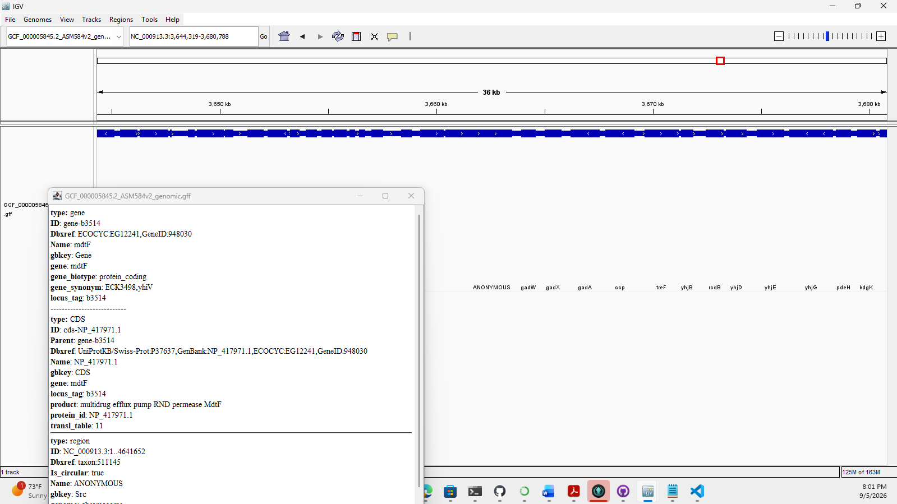

# Week 2: Obtain and Visualize Genomic Data

## Genome Selected

**Organism:** Escherichia coli K-12

**Assembly:** GCF_000005845.2_ASM584v2

### Files Used

- `GCF_000005845.2_ASM584v2_genomic.fna.gz`
- `GCF_000005845.2_ASM584v2_genomic.gff.gz`

---

## Prerequisites

Make sure you have the following tools installed locally:

- curl
- samtools
- htslib (for bgzip and tabix)
- IGV (Integrative Genomics Viewer)
- (optional) Picard (for CreateSequenceDictionary)


## Using the Makefile

To download the genome sequence and annotation files, run:

```bash
make download
```

This command downloads the gzipped FASTA genome sequence and GFF annotation file from NCBI.

---

## Prepare files for IGV (recommended)

After downloading, prepare the files for fast and reliable visualization in IGV.

1) Decompress or keep gzipped files. IGV can read gzipped FASTA/GFF but indexing improves performance.

```bash
# Example: keep gzipped FASTA but create an index
# Decompress to plain FASTA if you prefer
gunzip -c GCF_000005845.2_ASM584v2_genomic.fna.gz > GCF_000005845.2_ASM584v2_genomic.fna
samtools faidx GCF_000005845.2_ASM584v2_genomic.fna

# Optional: create a sequence dictionary (some tools / viewers use this)
# Requires Picard
picard CreateSequenceDictionary R=GCF_000005845.2_ASM584v2_genomic.fna O=GCF_000005845.2_ASM584v2_genomic.dict
```

2) Prepare the GFF for fast random access with bgzip/tabix (recommended):

```bash
# Re-compress with bgzip (if not already bgzip-compressed) and index
gunzip -c GCF_000005845.2_ASM584v2_genomic.gff.gz | bgzip -c > GCF_000005845.2_ASM584v2_genomic.gff.gz
tabix -p gff GCF_000005845.2_ASM584v2_genomic.gff.gz
```

Notes:
- bgzip + tabix allows IGV to fetch only the regions needed when viewing.
- If you don't have bgzip/tabix, IGV can still load the unindexed GFF but performance may be poor for large files.

---

## Obtain Genomic Data Questions

### 1. How large is the genome?

The genome is approximately **4,641,652 base pairs (4.64 Mb)** in length.

### 2. How many chromosomes does it have?

The genome contains **one chromosome**.

### 3. How many annotations are in the annotation file?

The annotation file contains thousands of annotated genomic features, including genes, coding sequences (CDS), regulatory elements, and other genomic annotations.

### 4. How complete is this genomic build?

This assembly appears highly complete because it is represented as a single chromosome with extensive annotation coverage and well-defined genomic features.

---

## Visualize a Genome Questions

### 1. How tightly packed are the genes?

The genes appear densely packed with relatively short intergenic regions, which is typical of bacterial genomes.

### 2. Pick a coordinate on the chromosome and visually inspect the surrounding sequence region.

**Coordinate inspected:**

`NC_000913.3:3,657,996-3,667,113`

### 3. Describe all six reading frames that the coordinate could be part of.

The sequence can potentially be translated in six reading frames:

- +1
- +2
- +3
- -1
- -2
- -3

The positive reading frames are located on the forward strand, while the negative reading frames are located on the reverse strand.

### 4. Identify the type of feature displayed as a data track.

The displayed data track contains **gene and coding sequence (CDS) annotations** derived from the GFF annotation file.

### 5. Color features by their strand orientation.

Features are displayed according to strand orientation, allowing forward-strand and reverse-strand genomic features to be distinguished visually.

---

## IGV Visualization

The FASTA and GFF files were successfully loaded into IGV.

Observed annotated genes included:

- gadW
- gadX
- gadA
- ccp
- treF
- yhjB
- rcdB
- yhjD
- yhjE
- yhjG
- pdeH
- kdgK

The annotation track displayed genomic features and their positions along the chromosome.

### IGV Annotation Screenshot

Include the image file `igv_annotation.png` in this directory so GitHub will display it here. To capture the screenshot in IGV: File -> Save Image.

Example Markdown to embed the image:



## Summary

This exercise demonstrated how to:

1. Download genomic sequence data from NCBI.
2. Obtain genome annotation files.
3. Load genomic data into IGV.
4. Explore genomic coordinates and gene annotations.
5. Visualize genomic features and strand orientation.
6. Interpret genome structure and annotation information.

---

## Reproducibility

The analysis can be reproduced by downloading the FASTA and GFF files using the Makefile and preparing them with the commands shown above before loading into IGV for visualization and inspection.
