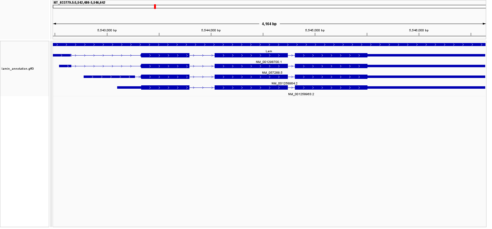
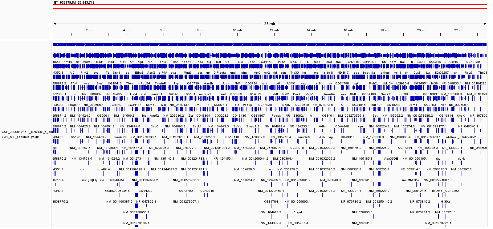
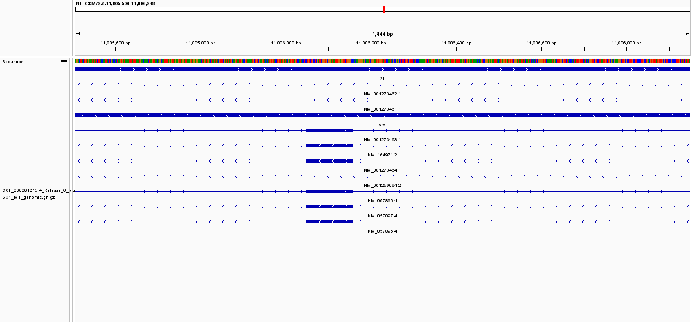
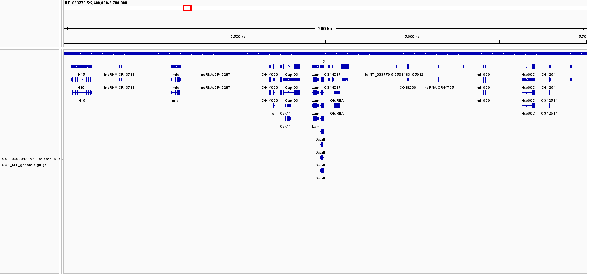
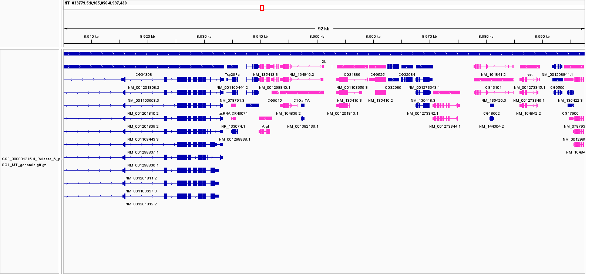
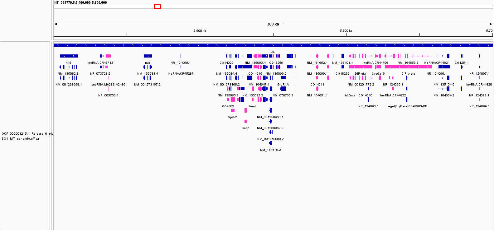

# Week 2: Annotate the Drosophila Lamin Gene

## Genome Selected

For this assignment, the genome of *Drosophila melanogaster* (fruit fly) was selected, with a focus on the **Lamin (`Lam`)** gene.

- **Organism:** *Drosophila melanogaster*
- **Assembly:** `GCF_000001215.4_Release_6_plus_ISO1_MT`
- **Repository:** [NCBI Assembly GCF_000001215.4](https://www.ncbi.nlm.nih.gov/datasets/genome/GCF_000001215.4/)
- **Annotation source:** FlyBase Release 6.54, distributed by NCBI RefSeq
- **Target gene:** `Lam`
- **NCBI locus tag:** `Dmel_CG6944`

---

# Reproducing the Analysis

## Required Software

The following command-line tools are required to reproduce the analysis:

```bash
make --version
curl --version
gzip --version
awk --version
grep --version
```

`samtools` is also recommended because the Makefile uses it, when available, to create a FASTA index:

```bash
samtools --version
```

**IGV Desktop** is required for the genome visualization portion of the assignment.

---

## Downloaded Genomic Data

The Makefile downloads the genomic FASTA, GFF3 annotation, and GTF annotation files directly from NCBI RefSeq.

The source files are:

- [Genome FASTA](https://ftp.ncbi.nlm.nih.gov/genomes/all/GCF/000/001/215/GCF_000001215.4_Release_6_plus_ISO1_MT/GCF_000001215.4_Release_6_plus_ISO1_MT_genomic.fna.gz)
- [GFF3 annotation](https://ftp.ncbi.nlm.nih.gov/genomes/all/GCF/000/001/215/GCF_000001215.4_Release_6_plus_ISO1_MT/GCF_000001215.4_Release_6_plus_ISO1_MT_genomic.gff.gz)
- [GTF annotation](https://ftp.ncbi.nlm.nih.gov/genomes/all/GCF/000/001/215/GCF_000001215.4_Release_6_plus_ISO1_MT/GCF_000001215.4_Release_6_plus_ISO1_MT_genomic.gtf.gz)

The Makefile also extracts Lamin-specific annotations and creates:

```text
data/lamin_annotation.gff3
data/lamin_annotation.gtf
```

All genomic data and generated annotation files are stored in the `data/` directory.

All IGV screenshots are stored separately in the `images/` directory.

---

## Running the Makefile

From the `Bismark_BMB852/Week-2` directory, the individual steps can be run with:

```bash
make download
make annotate
make count
```

Alternatively, the complete workflow can be reproduced with:

```bash
make
```

The Makefile:

1. Creates the `data/` directory.
2. Downloads the genomic FASTA file.
3. Downloads the complete GFF3 annotation.
4. Downloads the complete GTF annotation.
5. Decompresses the FASTA for use in IGV.
6. Creates a FASTA index if `samtools` is available.
7. Extracts annotation records associated with the `Lam` gene.
8. Counts annotation records.

After running the workflow, the `data/` directory contains:

```text
data/
├── GCF_000001215.4_Release_6_plus_ISO1_MT_genomic.fna.gz
├── GCF_000001215.4_Release_6_plus_ISO1_MT_genomic.fna
├── GCF_000001215.4_Release_6_plus_ISO1_MT_genomic.fna.fai
├── GCF_000001215.4_Release_6_plus_ISO1_MT_genomic.gff.gz
├── GCF_000001215.4_Release_6_plus_ISO1_MT_genomic.gtf.gz
├── lamin_annotation.gff3
└── lamin_annotation.gtf
```

If `samtools` is not installed, the `.fai` index will not be generated.

To remove the downloaded and generated genomic data and reproduce the workflow from the beginning:

```bash
make clean
make
```

---

# Lamin Annotation

The Lamin gene is annotated on the forward strand of:

```text
NT_033779.5
```

at:

```text
NT_033779.5:5,542,480-5,546,642
```

The GTF identifies the gene as:

```text
gene_id "Dmel_CG6944"
gene "Lam"
```

The extracted annotation includes features associated with multiple Lamin isoforms, including:

- gene
- transcript
- exon
- CDS
- start codon
- stop codon

---

# Genome Information

## Genome Size

The genome size was calculated using:

```bash
awk '/^>/ { next } { bp += length($0) } END { print bp }' \
data/GCF_000001215.4_Release_6_plus_ISO1_MT_genomic.fna
```

Output:

```text
143726002
```

Therefore, the downloaded genome contains:

**143,726,002 bp**

or approximately:

**143.73 Mb**

---

## Number of FASTA Sequence Records

The number of FASTA sequence records was determined using:

```bash
grep -c '^>' \
data/GCF_000001215.4_Release_6_plus_ISO1_MT_genomic.fna
```

Output:

```text
1870
```

Therefore, the FASTA contains **1,870 sequence records**.

---

## Number of Chromosomes

Biologically, *Drosophila melanogaster* has four chromosome pairs:

- X
- chromosome 2
- chromosome 3
- chromosome 4

However, the downloaded reference assembly contains **1,870 FASTA sequence records** because the assembly also includes chromosome arms, mitochondrial DNA, and unlocalized or unplaced sequences.

Therefore, the number of FASTA records should not be interpreted as the number of biological chromosomes.

---

## Number of Annotations

Annotation features were counted using:

```bash
zcat data/GCF_000001215.4_Release_6_plus_ISO1_MT_genomic.gff.gz | \
awk '!/^#/ && NF >= 3 { count[$3]++; total++ } END { for (k in count) print k, count[k]; print "TOTAL", total }' | \
sort -k2,2nr
```

The complete GFF3 annotation contains:

```text
TOTAL 414876
exon 190710
CDS 163319
mRNA 30802
gene 17537
```

Therefore, the complete GFF3 file contains:

**414,876 non-comment annotation records**

The Lamin-specific files contain:

```text
32 GFF3 records
40 GTF records
```

The Lamin-specific counts can be reproduced with:

```bash
grep -v '^#' data/lamin_annotation.gff3 | \
awk 'NF { count[$3]++; total++ } END { for (k in count) print k, count[k]; print "TOTAL", total }' | \
sort -k2,2nr
```

and:

```bash
grep -v '^#' data/lamin_annotation.gtf | \
awk 'NF { count[$3]++; total++ } END { for (k in count) print k, count[k]; print "TOTAL", total }' | \
sort -k2,2nr
```

---

## Completeness of the Genome Build

This is a high-quality reference assembly with extensive gene and transcript annotation.

The major *Drosophila melanogaster* chromosomal sequences are represented, but the assembly also contains mitochondrial, unlocalized, and unplaced sequence records.

Therefore, the completeness of the assembly should not be assessed solely from the number of FASTA records. The presence of well-assembled major chromosomal sequences together with extensive annotation makes this genome highly useful for genomic analysis and visualization.

---

# Genome Visualization in IGV

## Loading the Genome

The compressed FASTA file is decompressed by the Makefile.

The genome file loaded into IGV is:

```text
data/GCF_000001215.4_Release_6_plus_ISO1_MT_genomic.fna
```

The Lamin-specific annotation track is:

```text
data/lamin_annotation.gff3
```

The Lamin locus can be viewed at:

```text
NT_033779.5:5,542,480-5,546,642
```

---

## Lamin Annotation

The annotation track shows the Lamin gene and its different transcript structures.



**Figure 1.** Detailed IGV view of the *Drosophila melanogaster* Lamin (`Lam`) gene showing its transcript isoforms and exon structures.

---

## Genome Browsing

A wider IGV view shows genes surrounding the Lamin locus.



**Figure 2.** Wider IGV view of the Lamin locus and neighboring annotated genes.

---

## Additional Lamin View



**Figure 3.** Additional IGV view of the Lamin locus at `NT_033779.5:5,542,480-5,546,642`.

---

# Gene Density

The Lamin locus is highly gene-dense.

`Hel25E` ends approximately **165 bp before `Lam`**, while `Oscillin` begins approximately **443 bp after it**.

Additional nearby genes include:

- `CG14015`
- `tomb`
- `Cap-D3`
- `CG14014`

The wider region examined in IGV was:

```text
NT_033779.5:5,400,000-5,700,000
```



**Figure 4.** Wide IGV view of the approximately 300 kb Lamin neighborhood showing the density of nearby genes.

---

# Strand Orientation

The annotation features were colored according to their strand orientation in IGV.

Forward- and reverse-strand features can therefore be distinguished visually.

The `Lam` gene is annotated on the **forward (+) strand**.



**Figure 5.** IGV view showing annotation features colored according to strand orientation.

An expanded view of the annotation track is shown below:



**Figure 6.** Expanded annotation track showing individual transcript and feature rows.

---

# Six Possible Reading Frames

Double-stranded DNA has six possible reading frames:

| Strand | Reading Frames |
| --- | --- |
| Forward (+) | +1, +2, +3 |
| Reverse (-) | -1, -2, -3 |

The region:

```text
NT_033779.5:5,542,480-5,546,642
```

defines the Lamin locus, but it is a genomic interval rather than a single nucleotide coordinate.

To completely answer the reading-frame question, one nucleotide within this interval should be selected and examined at nucleotide resolution in IGV.

At a single selected nucleotide, the six possible codons would be recorded as:

| Strand | Reading Frame | Codon |
| --- | --- | --- |
| Forward (+) | +1 | `[CODON]` |
| Forward (+) | +2 | `[CODON]` |
| Forward (+) | +3 | `[CODON]` |
| Reverse (-) | -1 | `[CODON]` |
| Reverse (-) | -2 | `[CODON]` |
| Reverse (-) | -3 | `[CODON]` |

The actual codons should be determined by zooming to nucleotide resolution in IGV and examining the three possible reading frames on both DNA strands.

This distinction is important because `+1`, `+2`, `+3`, `-1`, `-2`, and `-3` identify the reading frames, but they do not themselves identify the six codons that contain the selected nucleotide.

---

# Feature Types Displayed

The Lamin annotation track contains multiple feature types, including:

- gene
- transcript
- exon
- CDS
- start codon
- stop codon

These features describe the structures of the different annotated `Lam` transcript isoforms.

---

# Summary

This workflow reproducibly downloads a *Drosophila melanogaster* reference genome and its GFF3 and GTF annotations from NCBI RefSeq and extracts annotation records associated with the Lamin (`Lam`) gene.

The analysis reproduced the following results:

- **Genome size:** 143,726,002 bp
- **FASTA sequence records:** 1,870
- **Complete GFF3 annotation records:** 414,876
- **Lamin-specific GFF3 records:** 32
- **Lamin-specific GTF records:** 40

The genomic data and generated annotations are stored in the `data/` directory, while all IGV screenshots are organized separately in the `images/` directory.

The Makefile allows the genomic data and Lamin-specific annotation files to be regenerated from the original NCBI source.