# Week 2: Genome-wide analysis of *Physcomitrium patens*

## Objective

This week analyzes the *Physcomitrium patens* reference genome that matches the
organism used in the Week-4 sequencing workflow. The earlier Lamin-specific
Drosophila analysis has been replaced with a genome-wide moss analysis.

The reference assembly is **GCA_000002425.2_Phypa_V3**, also known as the
Phypa V3 assembly. The genome and its annotation come from NCBI RefSeq.

### Quick genome summary

I selected the moss *Physcomitrium patens*, a non-model plant often used in
plant development research.

- Assembly: `GCA_000002425.2_Phypa_V3`
- Genome size: approximately **471.9 Mb** across **357 sequence records**
- Annotation: **374,631 GFF3 records** and **31,306 annotated genes**
- Main features: 162,252 exons, 149,462 CDS records, and 31,251 mRNAs
- Average genome-wide spacing: approximately **15.1 kb per annotated gene**
- Data source: NCBI RefSeq

The assembly includes chromosome-level sequences as well as additional
scaffolds and organellar records, so the 357 sequence records should not be
interpreted as 357 chromosomes. The annotation is detailed, but the large
gene-free intervals seen in IGV show that it is not appropriate to assume every
base is coding or that every noncoding region is fully annotated.

### Why this model organism is relevant

*Physcomitrium patens* is useful because it is a moss with a relatively compact,
well-annotated plant genome and strong public sequencing support. It is used to
study plant development, gene regulation, genome structure, and stress
responses. Because it is a non-flowering plant, it also helps researchers
compare conserved genes and pathways with those of flowering plants.

This assembly is directly relevant to Week 4 because the sequencing reads are
also from *P. patens*. Using the same organism and assembly makes later mapping,
coverage, variant, and gene-level analyses biologically meaningful. The genome
is large enough to show realistic gene-density patterns while remaining
practical for a teaching workflow.

## Reference data

- Organism: *Physcomitrium patens*
- Assembly: `GCA_000002425.2_Phypa_V3`
- NCBI assembly accession: [GCA_000002425.2](https://www.ncbi.nlm.nih.gov/datasets/genome/GCA_000002425.2/)
- Genome FASTA: [NCBI FASTA](https://ftp.ncbi.nlm.nih.gov/genomes/all/GCA/000/002/425/GCA_000002425.2_Phypa_V3/GCA_000002425.2_Phypa_V3_genomic.fna.gz)
- GFF3 annotation: [NCBI GFF3](https://ftp.ncbi.nlm.nih.gov/genomes/all/GCA/000/002/425/GCA_000002425.2_Phypa_V3/GCA_000002425.2_Phypa_V3_genomic.gff.gz)
- GTF annotation: [NCBI GTF](https://ftp.ncbi.nlm.nih.gov/genomes/all/GCA/000/002/425/GCA_000002425.2_Phypa_V3/GCA_000002425.2_Phypa_V3_genomic.gtf.gz)

The downloaded files are stored in `data/`. The compressed files are retained
for reproducibility, while the plain FASTA, GFF3, and GTF files are used for
inspection and genome-browser tools.

## Reproduce the workflow

From the `Week-2` directory:

```bash
make download
make annotate
make count
```

The Makefile downloads the matching FASTA, GFF3, and GTF files, decompresses
copies for local analysis, and reports genome-wide sequence and annotation
counts. No gene-specific extraction is performed.

To remove generated reference data and start again:

```bash
make clean
```

## Genome-wide results

The downloaded FASTA contains **471,852,792 bp** across **357 sequence
records**. These records include the principal chromosomes, organellar
sequences, and additional assembled scaffolds.

The GFF3 contains **374,631 non-comment feature records**. The main feature
categories are:

| Feature | Count |
| --- | ---: |
| Exon | 162,252 |
| CDS | 149,462 |
| Gene | 31,306 |
| mRNA | 31,251 |
| Region | 357 |
| Pseudogene | 3 |

These counts describe the complete annotation file. They are not counts of
unique genes only: one gene can have several transcripts, exons, and CDS rows.

## Questions and answers

### 1. How large is the genome?

The reference FASTA contains 471,852,792 bp. This is the total length of all
357 sequence records in the assembly.

### 2. How many sequence records are present?

There are 357 FASTA records. A sequence record can represent a chromosome,
scaffold, organelle, or another assembled sequence, so this number is not the
same as the number of biological chromosomes.

### 3. How many annotations are present?

The GFF3 contains 374,631 non-comment records. The largest categories are
162,252 exons, 149,462 CDS records, 31,306 genes, and 31,251 mRNAs.

### 4. Why use this genome for Week 4?

Week 4 uses *Physcomitrium patens* WGS reads from accession `ERR8982185`.
Using this matching assembly avoids the major error of mapping moss reads to
the unrelated *Drosophila melanogaster* genome. The same organism and assembly
should be used for the FASTA, annotation, and any alignment indexes.

## Useful commands

Genome size and sequence-record count:

```bash
awk '/^>/ { next } { bp += length($0) } END { print bp }' \
  data/GCA_000002425.2_Phypa_V3_genomic.fna

grep -c '^>' data/GCA_000002425.2_Phypa_V3_genomic.fna
```

Genome-wide GFF3 feature counts:

```bash
awk '!/^#/ && NF >= 3 { count[$3]++; total++ }
  END { for (k in count) print k, count[k]; print "TOTAL", total }' \
  data/GCA_000002425.2_Phypa_V3_genomic.gff | sort -k2,2nr
```

List sequence identifiers:

```bash
awk '/^>/ { sub(/^>/, ""); print $1 }' \
  data/GCA_000002425.2_Phypa_V3_genomic.fna
```

## Genome-browser use

For IGV or another genome browser, load:

1. `data/GCA_000002425.2_Phypa_V3_genomic.fna`
2. `data/GCA_000002425.2_Phypa_V3_genomic.gff`

Create a FASTA index first if `samtools` is available:

```bash
samtools faidx data/GCA_000002425.2_Phypa_V3_genomic.fna
```

The annotation is genome-wide, so a browser view can be opened at any annotated
moss gene or scaffold rather than only at the old Drosophila Lamin locus.

## IGV analysis

The following example replaces the earlier Lamin-centered IGV analysis with a
real annotated moss locus. The representative feature is `PHYPA_000001` on
the largest assembled sequence, `CM009316.1`.

### Files to load

In IGV, load these files:

1. `data/GCA_000002425.2_Phypa_V3_genomic.fna` as the genome
2. `data/GCA_000002425.2_Phypa_V3_genomic.gff` as the annotation track
3. `physcomitrium_igv_regions.bed` as the example-region track

The BED file marks both the gene and its 200 kb neighborhood. If IGV asks for
an index, create one with `samtools faidx` or use IGV's reference-management
option to index the FASTA locally.

### Representative gene view

Navigate to:

```text
CM009316.1:8,931-13,135
```

This interval contains gene `PHYPA_000001`, annotated on the forward strand.
The GFF3 track shows its gene model and child transcript, exon, and CDS
features. Zooming in reveals the exon structure; zooming out shows how the
transcript features are arranged within the gene interval.

### Strand view

The same chromosome contains genes on both strands. In the first 113 kb of
`CM009316.1`, the annotation includes:

| Gene | Coordinates | Strand |
| --- | --- | --- |
| `PHYPA_000001` | 8,931-13,135 | + |
| `PHYPA_000002` | 16,796-21,548 | + |
| `PHYPA_000003` | 29,286-36,549 | + |
| `PHYPA_000004` | 39,546-47,674 | + |
| `PHYPA_000005` | 50,338-53,342 | + |
| `PHYPA_000006` | 63,062-66,241 | + |
| `PHYPA_000007` | 72,037-74,718 | - |
| `PHYPA_000008` | 75,317-77,458 | - |
| `PHYPA_000009` | 93,934-99,543 | - |
| `PHYPA_000010` | 99,578-100,614 | - |

This gives the IGV view a useful biological question: nearby genes are not all
oriented in the same direction. The arrows and transcript models show the
forward and reverse strands directly.

### Gene-density view

There are **10 annotated genes within +/-100 kb** of `PHYPA_000001`. The genes
are distributed across the neighborhood rather than forming one continuous
coding block, and the final two reverse-strand genes are closely spaced near
100 kb. This is the genome-wide equivalent of the earlier local gene-density
analysis, but it uses moss annotation and coordinates.

For a wider IGV view, navigate to:

```text
CM009316.1:1-113,135
```

Then compare the annotation at whole-neighborhood, gene, and exon scales. IGV
will show the long chromosome as a broad coordinate range and the GFF3 track as
individual gene and transcript models.

The IGV analysis is annotation-based because Week 4 currently contains FASTQ
quality-control data, not aligned BAM files. Coverage tracks can be added after
the trimmed reads are mapped to this same Physcomitrium assembly.

### Generated IGV screenshots

The following screenshots were generated with IGV 2.18.4 in batch mode using
the reference FASTA, genome-wide GFF3, and BED region track described above.

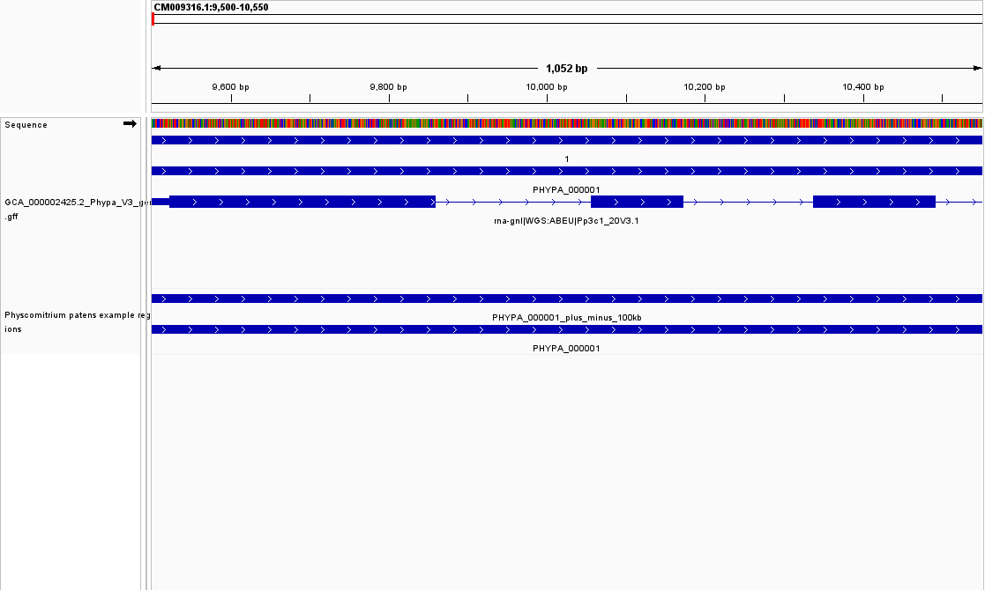

**Figure 1.** Four-times tighter view of `PHYPA_000001` at
`CM009316.1:9,500-10,550`, showing the central exon structure clearly.
The blue annotation track shows the gene model and directional feature arrows.

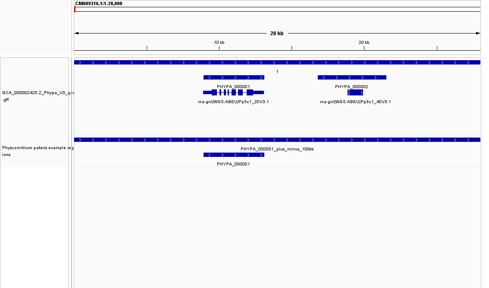

**Figure 2.** Four-times tighter 28 kb view of the `PHYPA_000001` neighborhood,
showing `PHYPA_000001` and `PHYPA_000002` with readable transcript models.

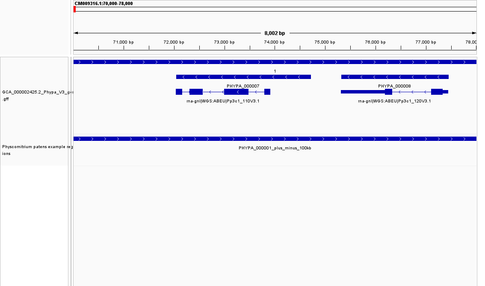

**Figure 3.** Four-times tighter 8 kb view of `CM009316.1:70,000-78,000`,
showing reverse-strand genes `PHYPA_000007` and `PHYPA_000008`.

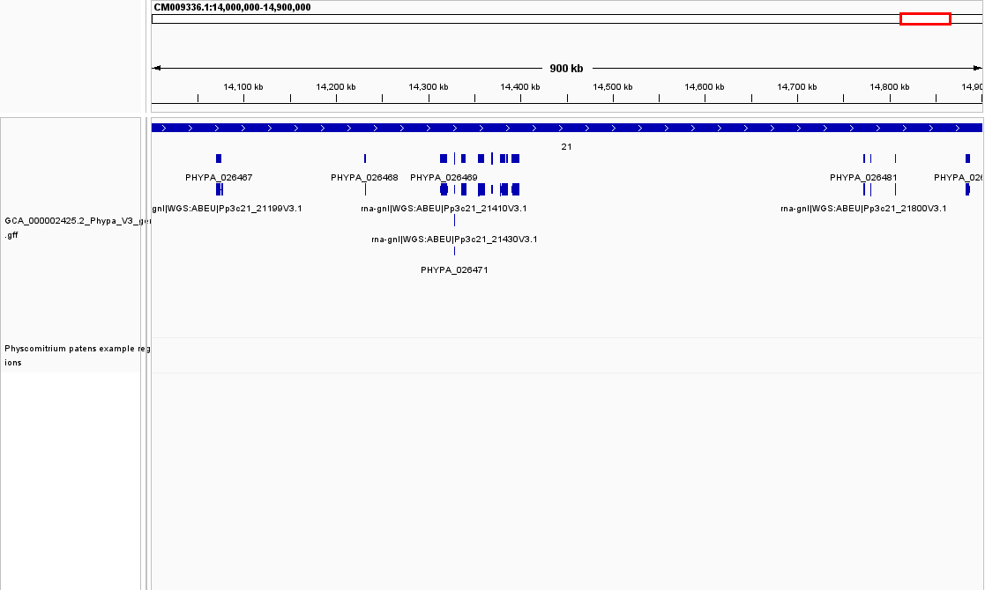

**Figure 4.** Four-times tighter 900 kb section of the largest gene-free
interval on `CM009336.1`, between `PHYPA_026480` and `PHYPA_026481`.

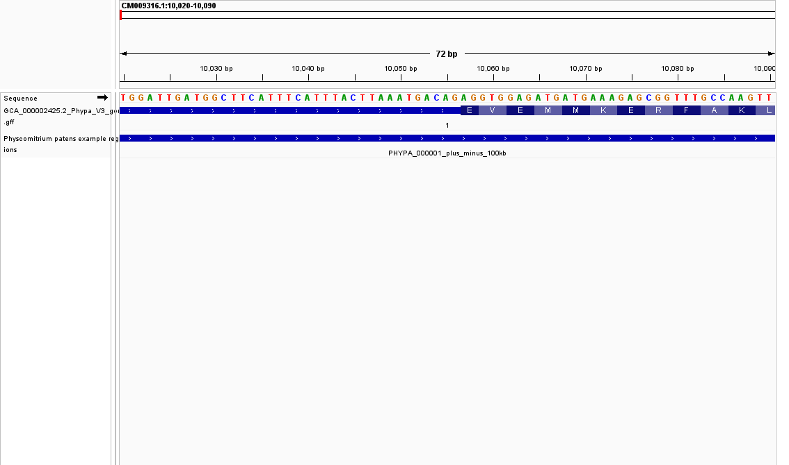

**Figure 5.** A 72 bp sequence-level view around `CM009316.1:10,020-10,090`.
IGV displays the reference bases and the annotation track at nucleotide scale.

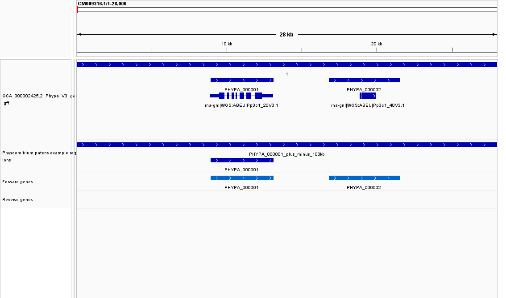

**Figure 6.** Four-times tighter 28 kb strand-colored view. Forward-strand
genes are blue and reverse-strand genes are pink.

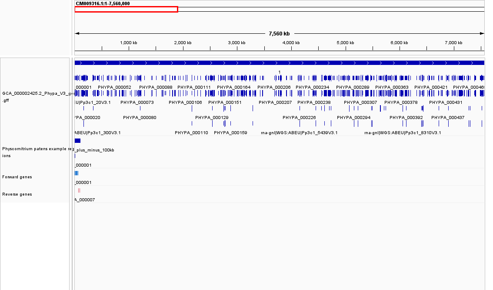

**Figure 7.** Four-times tighter 7.56 Mb genome-browsing view of `CM009316.1`.
This remains an overview, while Figures 9–12 provide the readable gene-level
detail.

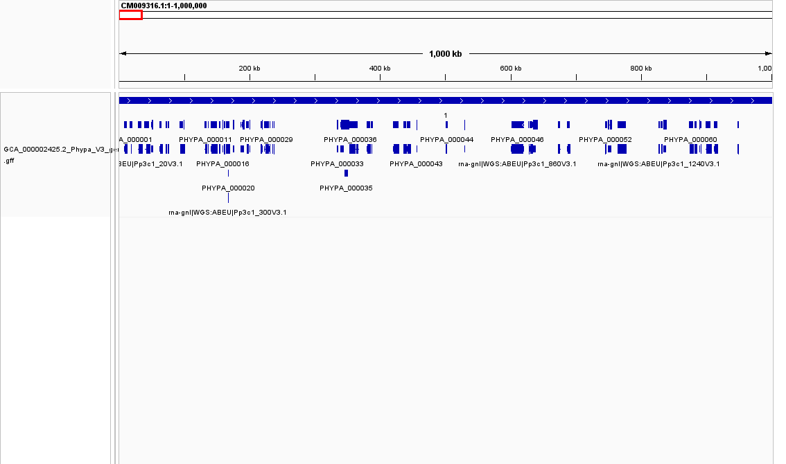

**Figure 7A.** Informative gene-spacing view of `CM009316.1:1-1,000,000`.
This scale shows many labeled genes and their relative spacing without reducing
the annotation to an unreadable chromosome-wide strip.

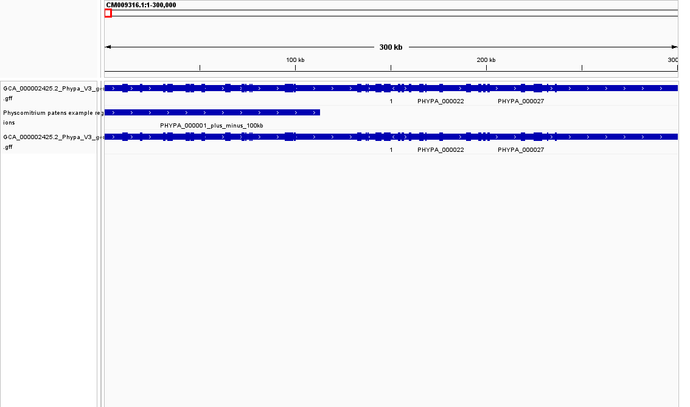

**Figure 8.** Expanded 300 kb view of the beginning of `CM009316.1`, showing
the local pattern of gene models and strand directions in more detail.

### Zoomed views for detailed inspection

The broad views above provide context, but the following tighter views are the
ones to use when reading labels and exon structure. They avoid compressing too
many genes into a single image.

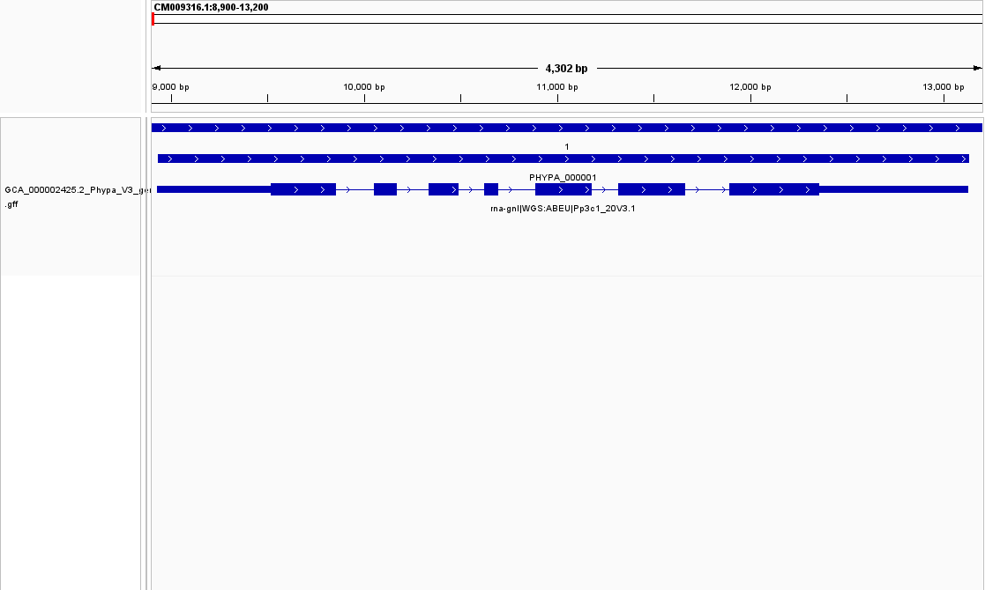

**Figure 9.** Full `PHYPA_000001` locus at `CM009316.1:8,900-13,200`.


**Figure 10.** Exon and intron detail at `CM009316.1:9,500-10,750`.

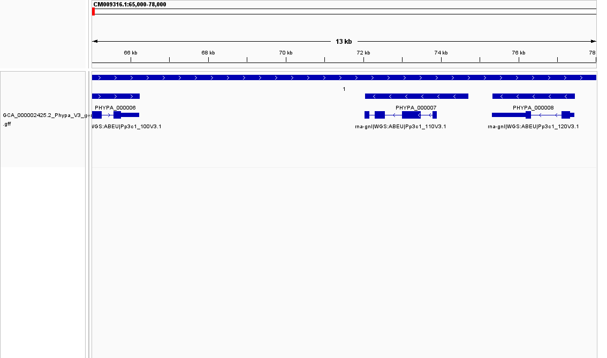

**Figure 11.** Forward-strand neighborhood at `CM009316.1:65,000-78,000`,
including `PHYPA_000006` through `PHYPA_000008`.

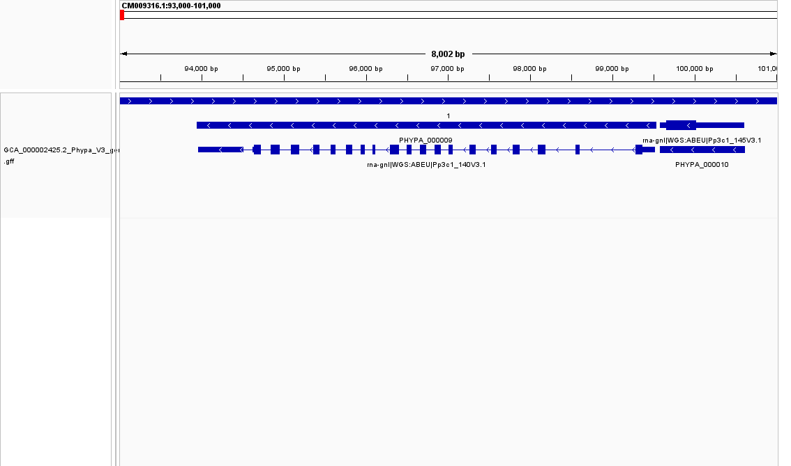

**Figure 12.** Reverse-strand neighborhood at `CM009316.1:93,000-101,000`,
including `PHYPA_000009` and `PHYPA_000010`.

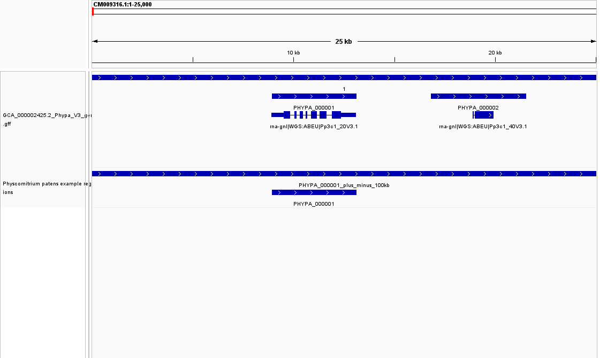

**Figure 13.** Zoomed 25 kb view showing `PHYPA_000001`, `PHYPA_000002`, their
transcript models, and the surrounding annotation track.

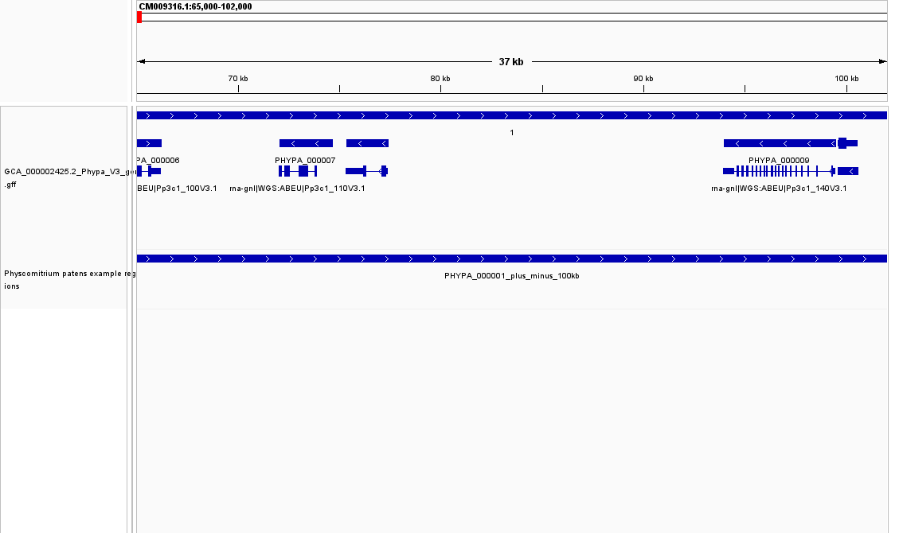

**Figure 14.** Zoomed 37 kb view of `CM009316.1:65,000-102,000`, showing the
forward and reverse gene models around `PHYPA_000007` through `PHYPA_000010`.

For the assignment screenshots, Figures 9-12 provide the clearest detail.
Figures 2, 7, 8, 13, and 14 are overview images and are included to show the
larger genomic context.

### Correspondence with the previous analysis

| Previous Lamin analysis | Physcomitrium replacement |
| --- | --- |
| Lamin close annotation view | `PHYPA_000001` close gene view |
| Lamin broad genome browsing | `CM009316.1:1-30,242,098` genome view |
| Chromosome-region inspection | `CM009316.1:8,931-13,135` gene interval |
| Strand-colored view | Blue forward and pink reverse tracks |
| Expanded strand view | `CM009316.1:1-300,000` neighborhood |
| Gene-density view | 10 genes within +/-100 kb of `PHYPA_000001` |
| Sequence/codon view | Six translations at `CM009316.1:10,020-10,090` |

The moss images show the same types of evidence as the earlier Lamin images,
but the coordinates, gene names, annotations, and conclusions come from the
*Physcomitrium patens* assembly.

### IGV questions and answers

**Q1. How are the genes spaced?**

The spacing is uneven. In the first 113 kb of `CM009316.1`, ten genes are
annotated, with several short gaps and a larger gap before `PHYPA_000009`.
Across the assembly, the largest gap between neighboring annotated genes is
371,597 bp on `CM009336.1`. This is a genuine annotation gap in the current
GFF3, although it could also contain unannotated or non-coding sequence.

**Q2. What happens at a small selected region?**

At `CM009316.1:8,931-13,135`, `PHYPA_000001` is annotated on the forward
strand. It contains multiple exons and CDS segments, so the gene model becomes
more detailed as the IGV view is zoomed in. The gene is annotated as a
protein-coding locus, but its product is listed as a hypothetical protein in
this assembly annotation.

**Q3. Can an intron be translated as a gene?**

The sequence-level view shows why this question needs caution. DNA can be read
in three forward frames and three reverse-complement frames, but a translated
open reading frame is not automatically a real gene. An intron may contain a
short accidental open reading frame without having a promoter, transcript, or
validated protein product. For this analysis, the annotated exon/CDS structure
is stronger evidence than a short translation found only by chance.

For the selected sequence `CM009316.1:10,020-10,090`, the six possible reading
frames are:

```text
Forward +1: WIDGFISFT*MTEVEMMKERFAK
Forward +2: GLMASFHLLK*QRWR**KSGLPS
Forward +3: D*WLHFIYLNDRGGDDERAVCQV
Reverse -1: NLANRSFIISTSVI*VNEMKPSI
Reverse -2: TWQTALSSSPPLSFK*MK*SHQS
Reverse -3: LGKPLFHHLHLCHLSK*NEAINP
```

The asterisks represent stop codons. These six translations show what each
frame could encode, but they do not prove that the region is a real gene. The
GFF3 annotation and transcript evidence are stronger evidence for deciding
which sequence is biologically meaningful.

**Q4. What data are visible in IGV?**

The current screenshots contain the reference sequence, the genome-wide GFF3
annotation, and the BED region track. There is no BAM coverage track yet,
because Week 4 has quality-controlled FASTQ files but they have not been
aligned. Therefore these images show genome structure and annotation, not read
depth or variant evidence.

**Q5. What do the strand directions show?**

The arrows in the annotation track indicate transcription direction. Genes
`PHYPA_000001` through `PHYPA_000006` in the selected neighborhood are on the
forward strand, while `PHYPA_000007` and `PHYPA_000008` are on the reverse
strand. `PHYPA_000009` and `PHYPA_000010` are also reverse-strand genes near the
end of the neighborhood.

**Q6. What is the overall conclusion?**

The moss genome is densely annotated in some regions but also contains broad
gene-poor intervals. The GFF3 provides useful exon, transcript, CDS, and strand
information, but it does not provide quantitative evidence by itself. The next
step would be to map the trimmed Week-4 reads to this same assembly and add the
resulting BAM and coverage tracks to IGV.

## Downstream analysis

The matching reference can now support the Week-4 reads for:

- Alignment and mapping-rate measurement
- Genome-coverage analysis
- Variant discovery
- Gene-level read counting
- Inspection of genes and transcript models in IGV

The FASTQ quality-control results must still be interpreted separately from
biological conclusions. FastQC evaluates the technical quality of reads; the
reference genome becomes necessary when those reads are mapped and analyzed.
