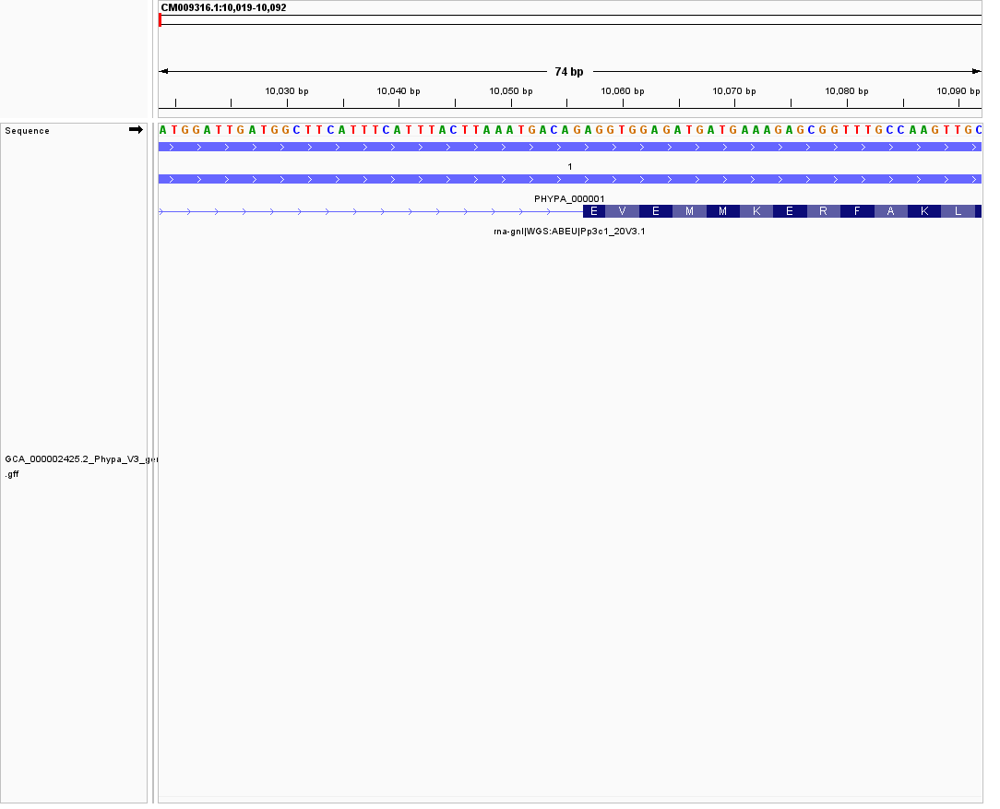
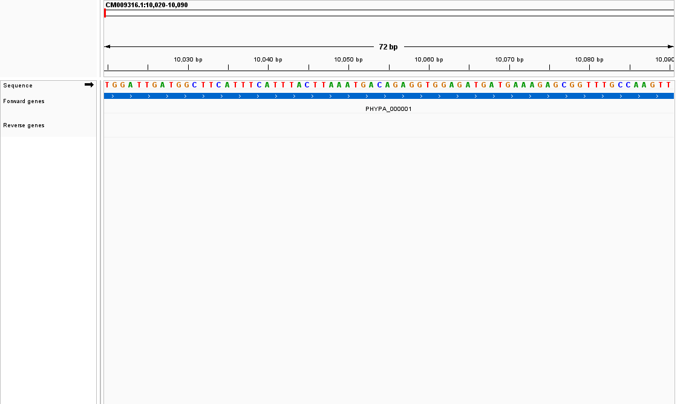
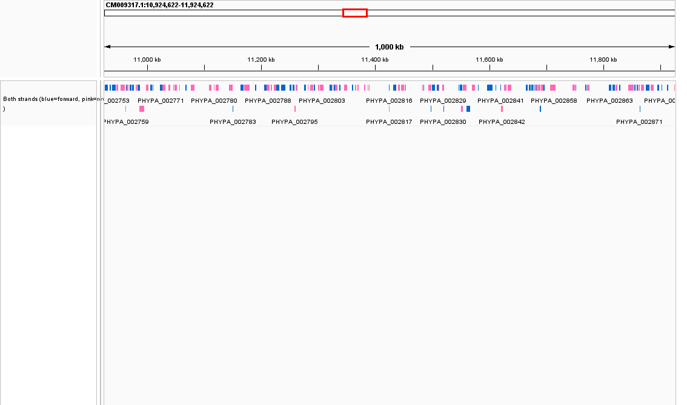
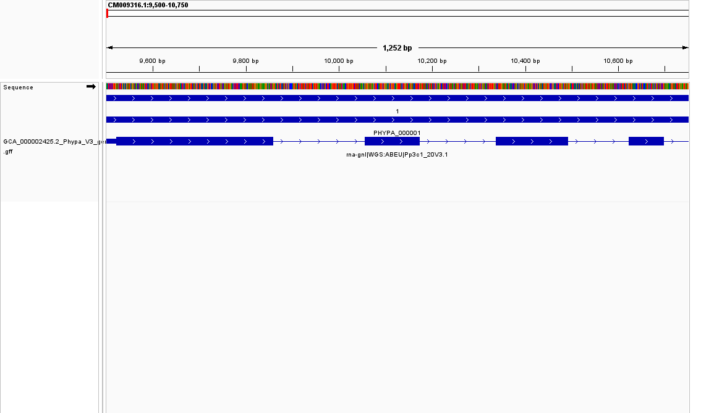

# Week 2: Genome-wide analysis of *Physcomitrium patens*

## Objective

This week analyzes the *Physcomitrium patens* reference genome that matches the
organism used in the Week-4 sequencing workflow. The earlier Lamin-specific
Drosophila analysis has been replaced with a genome-wide moss analysis.

The reference assembly is **GCA_000002425.2_Phypa_V3**, also known as the
Phypa V3 assembly. The genome and its annotation come from NCBI RefSeq.

### Quick genome summary

I selected the moss *Physcomitrium patens*, a non-model plant often used in
plant development research.

- Assembly: `GCA_000002425.2_Phypa_V3`
- Genome size: approximately **471.9 Mb** across **357 sequence records**
- Annotation: **374,631 GFF3 records** and **31,306 annotated genes**
- Main features: 162,252 exons, 149,462 CDS records, and 31,251 mRNAs
- Average genome-wide spacing: approximately **15.1 kb per annotated gene**
- Data source: NCBI RefSeq

The assembly includes chromosome-level sequences as well as additional
scaffolds and organellar records, so the 357 sequence records should not be
interpreted as 357 chromosomes. The annotation is detailed, but the large
gene-free intervals seen in IGV show that it is not appropriate to assume every
base is coding or that every noncoding region is fully annotated.

### Why this model organism is relevant

*Physcomitrium patens* is useful because it is a moss with a relatively compact,
well-annotated plant genome and strong public sequencing support. It is used to
study plant development, gene regulation, genome structure, and stress
responses. Because it is a non-flowering plant, it also helps researchers
compare conserved genes and pathways with those of flowering plants.

This assembly is directly relevant to Week 4 because the sequencing reads are
also from *P. patens*. Using the same organism and assembly makes later mapping,
coverage, variant, and gene-level analyses biologically meaningful. The genome
is large enough to show realistic gene-density patterns while remaining
practical for a teaching workflow.

## Reference data

- Organism: *Physcomitrium patens*
- Assembly: `GCA_000002425.2_Phypa_V3`
- NCBI assembly accession: [GCA_000002425.2](https://www.ncbi.nlm.nih.gov/datasets/genome/GCA_000002425.2/)
- Genome FASTA: [NCBI FASTA](https://ftp.ncbi.nlm.nih.gov/genomes/all/GCA/000/002/425/GCA_000002425.2_Phypa_V3/GCA_000002425.2_Phypa_V3_genomic.fna.gz)
- GFF3 annotation: [NCBI GFF3](https://ftp.ncbi.nlm.nih.gov/genomes/all/GCA/000/002/425/GCA_000002425.2_Phypa_V3/GCA_000002425.2_Phypa_V3_genomic.gff.gz)
- GTF annotation: [NCBI GTF](https://ftp.ncbi.nlm.nih.gov/genomes/all/GCA/000/002/425/GCA_000002425.2_Phypa_V3/GCA_000002425.2_Phypa_V3_genomic.gtf.gz)

The downloaded files are stored in `data/`. The compressed files are retained
for reproducibility, while the plain FASTA, GFF3, and GTF files are used for
inspection and genome-browser tools.

## Reproduce the workflow

From the `Week-2` directory:

```bash
make download
make annotate
make count
```

The Makefile downloads the matching FASTA, GFF3, and GTF files, decompresses
copies for local analysis, and reports genome-wide sequence and annotation
counts. No gene-specific extraction is performed.

To remove generated reference data and start again:

```bash
make clean
```

Genome size and sequence-record count:

```bash
awk '/^>/ { next } { bp += length($0) } END { print bp }' \
  data/GCA_000002425.2_Phypa_V3_genomic.fna

grep -c '^>' data/GCA_000002425.2_Phypa_V3_genomic.fna
```

Genome-wide GFF3 feature counts:

```bash
awk '!/^#/ && NF >= 3 { count[$3]++; total++ }
  END { for (k in count) print k, count[k]; print "TOTAL", total }' \
  data/GCA_000002425.2_Phypa_V3_genomic.gff | sort -k2,2nr
```

List sequence identifiers:

```bash
awk '/^>/ { sub(/^>/, ""); print $1 }' \
  data/GCA_000002425.2_Phypa_V3_genomic.fna
```

## Genome-browser use

For IGV or another genome browser, load:

1. `data/GCA_000002425.2_Phypa_V3_genomic.fna`
2. `data/GCA_000002425.2_Phypa_V3_genomic.gff`

Create a FASTA index first if `samtools` is available:

```bash
samtools faidx data/GCA_000002425.2_Phypa_V3_genomic.fna
```

The annotation is genome-wide, so a browser view can be opened at any annotated
moss gene or scaffold rather than only at the old Drosophila Lamin locus.

## Assignment figures and answers

The following section presents the required IGV work in the same order as the
assignment questions. The longer gallery below contains additional context
images.

### Question 1: Gene spacing

The genes are unevenly spaced in the selected moss region. Some neighboring
genes are close together, while other intervals contain larger noncoding gaps.
The blue and pink features show that genes occur on both strands.


**Figure 1.** Genome browsing and gene spacing in *Physcomitrium patens*.
The broad `CM009316.1` view shows many annotated genes and their relative
spacing. Forward-strand features are blue and reverse-strand features are pink.

### Question 2: Selected coordinate

I selected `CM009316.1:10,020-10,090`, a 72 bp interval inside the
forward-strand gene `PHYPA_000001`. The IGV view shows the reference bases, the
transcript model, and the translated coding sequence.



**Figure 2.** Reference sequence and annotation at the selected 72 bp region.

### Question 3: Six reading frames

The selected DNA can be read in three forward frames and three
reverse-complement frames:

```text
Forward +1: WIDGFISFT*MTEVEMMKERFAK
Forward +2: GLMASFHLLK*QRWR**KSGLPS
Forward +3: D*WLHFIYLNDRGGDDERAVCQV
Reverse -1: NLANRSFIISTSVI*VNEMKPSI
Reverse -2: TWQTALSSSPPLSFK*MK*SHQS
Reverse -3: LGKPLFHHLHLCHLSK*NEAINP
```

The asterisks represent stop codons. These translations show possible reading
frames, but they do not prove that the sequence is an independently functioning
gene. The GFF3 annotation and transcript evidence are stronger evidence.



**Figure 4.** IGV sequence-level view used to inspect the selected coding region
and its translated frame.

### Question 4: Annotation features

The IGV annotation track comes from the GFF3 file. It shows `gene`, `mRNA`,
`exon`, and `CDS` features. Thick blocks represent annotated features and thin
connecting lines represent transcript structure across introns. The DNA and
amino-acid rows show reference and translated sequence. No BAM file is loaded,
so the images do not show read coverage, expression, or variant data.



**Figure 3.** Combined annotation view with forward-strand features in blue and
reverse-strand features in pink.



**Figure 5.** Zoomed annotation view showing gene, transcript, exon, intron,
and CDS structure for `PHYPA_000001`.

## IGV analysis

The following example replaces the earlier Lamin-centered IGV analysis with a
real annotated moss locus. The representative feature is `PHYPA_000001` on
the largest assembled sequence, `CM009316.1`.

### Files to load

In IGV, load these files:

1. `data/GCA_000002425.2_Phypa_V3_genomic.fna` as the genome
2. `data/GCA_000002425.2_Phypa_V3_genomic.gff` as the annotation track
3. `physcomitrium_igv_regions.bed` as the example-region track

The BED file marks both the gene and its 200 kb neighborhood. If IGV asks for
an index, create one with `samtools faidx` or use IGV's reference-management
option to index the FASTA locally.

### Representative gene view

Navigate to:

```text
CM009316.1:8,931-13,135
```

This interval contains gene `PHYPA_000001`, annotated on the forward strand.
The GFF3 track shows its gene model and child transcript, exon, and CDS
features. Zooming in reveals the exon structure; zooming out shows how the
transcript features are arranged within the gene interval.

### Strand view

The same chromosome contains genes on both strands. In the first 113 kb of
`CM009316.1`, the annotation includes:

| Gene | Coordinates | Strand |
| --- | --- | --- |
| `PHYPA_000001` | 8,931-13,135 | + |
| `PHYPA_000002` | 16,796-21,548 | + |
| `PHYPA_000003` | 29,286-36,549 | + |
| `PHYPA_000004` | 39,546-47,674 | + |
| `PHYPA_000005` | 50,338-53,342 | + |
| `PHYPA_000006` | 63,062-66,241 | + |
| `PHYPA_000007` | 72,037-74,718 | - |
| `PHYPA_000008` | 75,317-77,458 | - |
| `PHYPA_000009` | 93,934-99,543 | - |
| `PHYPA_000010` | 99,578-100,614 | - |

This gives the IGV view a useful biological question: nearby genes are not all
oriented in the same direction. The arrows and transcript models show the
forward and reverse strands directly.

### Gene-density view

There are **10 annotated genes within +/-100 kb** of `PHYPA_000001`. The genes
are distributed across the neighborhood rather than forming one continuous
coding block, and the final two reverse-strand genes are closely spaced near
100 kb. This is the genome-wide equivalent of the earlier local gene-density
analysis, but it uses moss annotation and coordinates.

For a wider IGV view, navigate to:

```text
CM009316.1:1-113,135
```

Then compare the annotation at whole-neighborhood, gene, and exon scales. IGV
will show the long chromosome as a broad coordinate range and the GFF3 track as
individual gene and transcript models.

The IGV analysis is annotation-based because Week 4 currently contains FASTQ
quality-control data, not aligned BAM files. Coverage tracks can be added after
the trimmed reads are mapped to this same Physcomitrium assembly.

### Expanded dense-coordinate analysis

To make the gene-spacing analysis more informative, I selected the densest
one-megabase interval found in the annotation:

```text
CM009317.1:10,924,622-11,924,622
```

This interval contains **126 annotated genes**: 59 on the forward strand and
67 on the reverse strand. The largest internal gap between neighboring genes is
35,006 bp. This is a better overview coordinate than a whole-chromosome view
because it shows many gene models while keeping their labels and exon patterns
visible.

### Answers from the expanded coordinate

**How tightly packed are the genes?**

They are tightly packed in this selected region: 126 genes occur across 1 Mb,
or approximately one annotated gene every 7.9 kb on average. The actual gaps
vary because genes have different lengths and some are close together while
others are separated by larger noncoding intervals.

**What do the blue and pink tracks show?**

The forward and reverse tracks separate genes by strand orientation. In the
selected interval, 59 genes are forward-oriented and 67 are reverse-oriented.
The arrows and transcript directions should be read together with the labels;
the two tracks do not represent expression or read abundance.

**What type of feature is shown?**

The tracks come from the genome-wide GFF3 annotation. They show gene, mRNA,
exon, and CDS features. The thick blocks represent annotated features and the
connecting lines represent transcript structure across introns. Because no BAM
file has been loaded, these images contain annotation only and no quantitative
coverage signal.

**What is the main conclusion?**

The moss genome is not uniformly organized. Some regions are gene-dense, like
this 1 Mb interval, while other parts contain much larger gene-free gaps. A
genome-wide overview is useful for context, but zoomed intervals are needed to
interpret gene names, exon structure, and strand direction clearly.

### Assignment question count

The assignment has **four genome-browsing questions**:

1. How tightly packed are the genes?
2. What sequence is present at a selected coordinate?
3. What are the six possible reading frames at that coordinate?
4. What type of feature is shown in the annotation track?

The earlier genome-download section adds four background questions about genome
size, chromosome/sequence records, annotation counts, and assembly completeness.
Together, the README answers eight required question areas.

### Correspondence with the previous analysis

| Previous Lamin analysis | Physcomitrium replacement |
| --- | --- |
| Lamin close annotation view | `PHYPA_000001` close gene view |
| Lamin broad genome browsing | `CM009316.1:1-30,242,098` genome view |
| Chromosome-region inspection | `CM009316.1:8,931-13,135` gene interval |
| Strand-colored view | Blue forward and pink reverse tracks |
| Expanded strand view | `CM009316.1:1-300,000` neighborhood |
| Gene-density view | 10 genes within +/-100 kb of `PHYPA_000001` |
| Sequence/codon view | Six translations at `CM009316.1:10,020-10,090` |

The moss images show the same types of evidence as the earlier Lamin images,
but the coordinates, gene names, annotations, and conclusions come from the
*Physcomitrium patens* assembly.

### IGV questions and answers

**Q1. How are the genes spaced?**

The spacing is uneven. In the first 113 kb of `CM009316.1`, ten genes are
annotated, with several short gaps and a larger gap before `PHYPA_000009`.
Across the assembly, the largest gap between neighboring annotated genes is
371,597 bp on `CM009336.1`. This is a genuine annotation gap in the current
GFF3, although it could also contain unannotated or non-coding sequence.

**Q2. What happens at a small selected region?**

At `CM009316.1:10,020-10,090`, the selected 72 bp interval overlaps the
forward-strand gene `PHYPA_000001`. The IGV sequence view shows the reference
bases, the transcript model, and the translated amino-acid sequence. This
interval is part of an annotated coding region whose product is listed as a
hypothetical protein in this assembly annotation.

**Q3. Can an intron be translated as a gene?**

The sequence-level view shows why this question needs caution. DNA can be read
in three forward frames and three reverse-complement frames, but a translated
open reading frame is not automatically a real gene. An intron may contain a
short accidental open reading frame without having a promoter, transcript, or
validated protein product. For this analysis, the annotated exon/CDS structure
is stronger evidence than a short translation found only by chance.

For the selected sequence `CM009316.1:10,020-10,090`, the six possible reading
frames are:

```text
Forward +1: WIDGFISFT*MTEVEMMKERFAK
Forward +2: GLMASFHLLK*QRWR**KSGLPS
Forward +3: D*WLHFIYLNDRGGDDERAVCQV
Reverse -1: NLANRSFIISTSVI*VNEMKPSI
Reverse -2: TWQTALSSSPPLSFK*MK*SHQS
Reverse -3: LGKPLFHHLHLCHLSK*NEAINP
```

The asterisks represent stop codons. These six translations show what each
frame could encode, but they do not prove that the region is a real gene. The
GFF3 annotation and transcript evidence are stronger evidence for deciding
which sequence is biologically meaningful.

**Q4. What data are visible in IGV?**

The current screenshots contain the reference sequence, the genome-wide GFF3
annotation, and the BED region track. There is no BAM coverage track yet,
because Week 4 has quality-controlled FASTQ files but they have not been
aligned. Therefore these images show genome structure and annotation, not read
depth or variant evidence.

The visible annotation features are `gene`, `mRNA`, `exon`, and `CDS` records.
In the close sequence view, the colored DNA letters are the reference bases and
the amino-acid row is the predicted translation supplied by IGV. The blue and
pink tracks in the dense view distinguish forward- and reverse-strand gene
features; they do not represent expression levels or read abundance.

**Q5. What do the strand directions show?**

The arrows in the annotation track indicate transcription direction. Genes
`PHYPA_000001` through `PHYPA_000006` in the selected neighborhood are on the
forward strand, while `PHYPA_000007` and `PHYPA_000008` are on the reverse
strand. `PHYPA_000009` and `PHYPA_000010` are also reverse-strand genes near the
end of the neighborhood.

**Q6. What is the overall conclusion?**

The moss genome is densely annotated in some regions but also contains broad
gene-poor intervals. The GFF3 provides useful exon, transcript, CDS, and strand
information, but it does not provide quantitative evidence by itself. The next
step would be to map the trimmed Week-4 reads to this same assembly and add the
resulting BAM and coverage tracks to IGV.

## Downstream analysis

The matching reference can now support the Week-4 reads for:

- Alignment and mapping-rate measurement
- Genome-coverage analysis
- Variant discovery
- Gene-level read counting
- Inspection of genes and transcript models in IGV

The FASTQ quality-control results must still be interpreted separately from
biological conclusions. FastQC evaluates the technical quality of reads; the
reference genome becomes necessary when those reads are mapped and analyzed.
