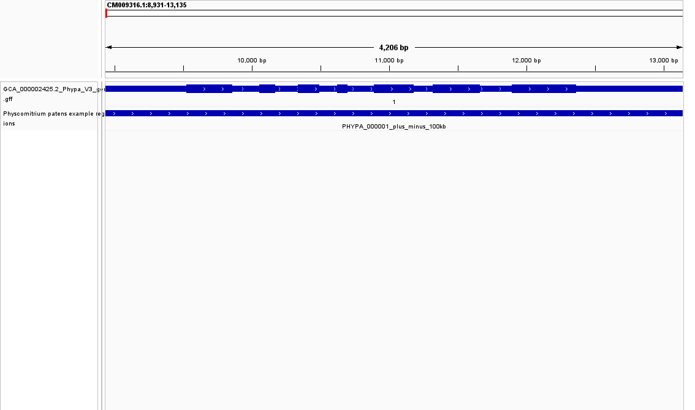
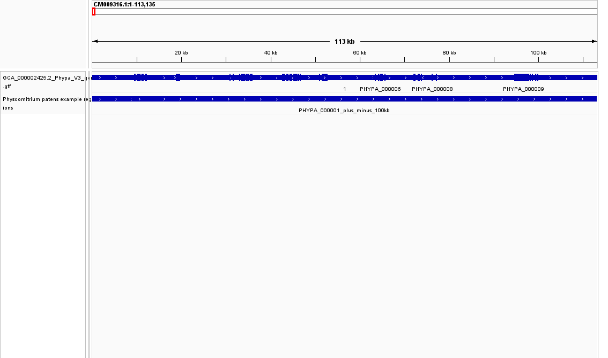
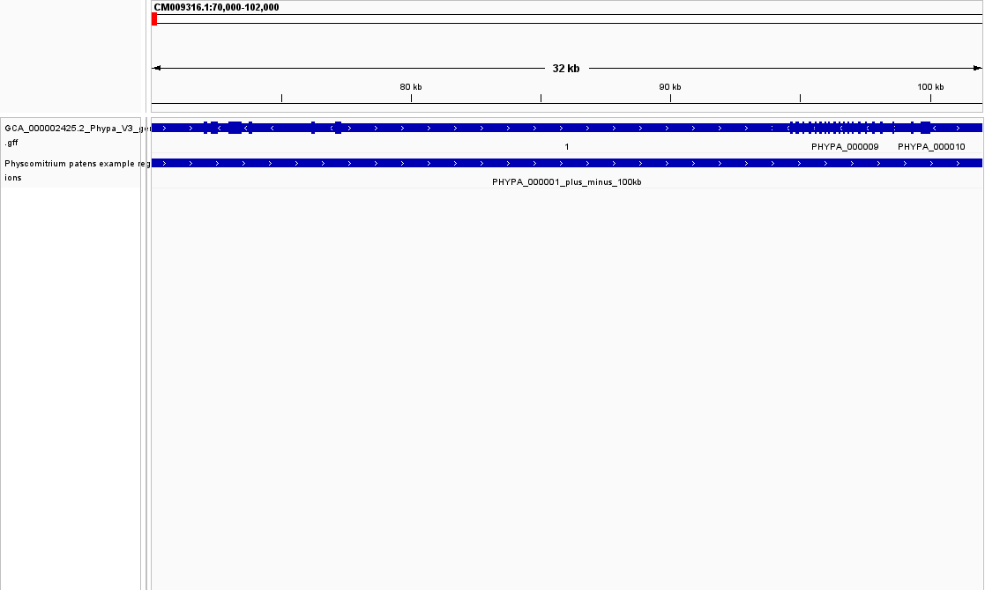

# Week 2: Genome-wide analysis of *Physcomitrium patens*

## Objective

This week analyzes the *Physcomitrium patens* reference genome that matches the
organism used in the Week-4 sequencing workflow. The earlier Lamin-specific
Drosophila analysis has been replaced with a genome-wide moss analysis.

The reference assembly is **GCA_000002425.2_Phypa_V3**, also known as the
Phypa V3 assembly. The genome and its annotation come from NCBI RefSeq.

## Reference data

- Organism: *Physcomitrium patens*
- Assembly: `GCA_000002425.2_Phypa_V3`
- NCBI assembly accession: [GCA_000002425.2](https://www.ncbi.nlm.nih.gov/datasets/genome/GCA_000002425.2/)
- Genome FASTA: [NCBI FASTA](https://ftp.ncbi.nlm.nih.gov/genomes/all/GCA/000/002/425/GCA_000002425.2_Phypa_V3/GCA_000002425.2_Phypa_V3_genomic.fna.gz)
- GFF3 annotation: [NCBI GFF3](https://ftp.ncbi.nlm.nih.gov/genomes/all/GCA/000/002/425/GCA_000002425.2_Phypa_V3/GCA_000002425.2_Phypa_V3_genomic.gff.gz)
- GTF annotation: [NCBI GTF](https://ftp.ncbi.nlm.nih.gov/genomes/all/GCA/000/002/425/GCA_000002425.2_Phypa_V3/GCA_000002425.2_Phypa_V3_genomic.gtf.gz)

The downloaded files are stored in `data/`. The compressed files are retained
for reproducibility, while the plain FASTA, GFF3, and GTF files are used for
inspection and genome-browser tools.

## Reproduce the workflow

From the `Week-2` directory:

```bash
make download
make annotate
make count
```

The Makefile downloads the matching FASTA, GFF3, and GTF files, decompresses
copies for local analysis, and reports genome-wide sequence and annotation
counts. No gene-specific extraction is performed.

To remove generated reference data and start again:

```bash
make clean
```

## Genome-wide results

The downloaded FASTA contains **471,852,792 bp** across **357 sequence
records**. These records include the principal chromosomes, organellar
sequences, and additional assembled scaffolds.

The GFF3 contains **374,631 non-comment feature records**. The main feature
categories are:

| Feature | Count |
| --- | ---: |
| Exon | 162,252 |
| CDS | 149,462 |
| Gene | 31,306 |
| mRNA | 31,251 |
| Region | 357 |
| Pseudogene | 3 |

These counts describe the complete annotation file. They are not counts of
unique genes only: one gene can have several transcripts, exons, and CDS rows.

## Questions and answers

### 1. How large is the genome?

The reference FASTA contains 471,852,792 bp. This is the total length of all
357 sequence records in the assembly.

### 2. How many sequence records are present?

There are 357 FASTA records. A sequence record can represent a chromosome,
scaffold, organelle, or another assembled sequence, so this number is not the
same as the number of biological chromosomes.

### 3. How many annotations are present?

The GFF3 contains 374,631 non-comment records. The largest categories are
162,252 exons, 149,462 CDS records, 31,306 genes, and 31,251 mRNAs.

### 4. Why use this genome for Week 4?

Week 4 uses *Physcomitrium patens* WGS reads from accession `ERR8982185`.
Using this matching assembly avoids the major error of mapping moss reads to
the unrelated *Drosophila melanogaster* genome. The same organism and assembly
should be used for the FASTA, annotation, and any alignment indexes.

## Useful commands

Genome size and sequence-record count:

```bash
awk '/^>/ { next } { bp += length($0) } END { print bp }' \
  data/GCA_000002425.2_Phypa_V3_genomic.fna

grep -c '^>' data/GCA_000002425.2_Phypa_V3_genomic.fna
```

Genome-wide GFF3 feature counts:

```bash
awk '!/^#/ && NF >= 3 { count[$3]++; total++ }
  END { for (k in count) print k, count[k]; print "TOTAL", total }' \
  data/GCA_000002425.2_Phypa_V3_genomic.gff | sort -k2,2nr
```

List sequence identifiers:

```bash
awk '/^>/ { sub(/^>/, ""); print $1 }' \
  data/GCA_000002425.2_Phypa_V3_genomic.fna
```

## Genome-browser use

For IGV or another genome browser, load:

1. `data/GCA_000002425.2_Phypa_V3_genomic.fna`
2. `data/GCA_000002425.2_Phypa_V3_genomic.gff`

Create a FASTA index first if `samtools` is available:

```bash
samtools faidx data/GCA_000002425.2_Phypa_V3_genomic.fna
```

The annotation is genome-wide, so a browser view can be opened at any annotated
moss gene or scaffold rather than only at the old Drosophila Lamin locus.

## IGV analysis

The following example replaces the earlier Lamin-centered IGV analysis with a
real annotated moss locus. The representative feature is `PHYPA_000001` on
the largest assembled sequence, `CM009316.1`.

### Files to load

In IGV, load these files:

1. `data/GCA_000002425.2_Phypa_V3_genomic.fna` as the genome
2. `data/GCA_000002425.2_Phypa_V3_genomic.gff` as the annotation track
3. `physcomitrium_igv_regions.bed` as the example-region track

The BED file marks both the gene and its 200 kb neighborhood. If IGV asks for
an index, create one with `samtools faidx` or use IGV's reference-management
option to index the FASTA locally.

### Representative gene view

Navigate to:

```text
CM009316.1:8,931-13,135
```

This interval contains gene `PHYPA_000001`, annotated on the forward strand.
The GFF3 track shows its gene model and child transcript, exon, and CDS
features. Zooming in reveals the exon structure; zooming out shows how the
transcript features are arranged within the gene interval.

### Strand view

The same chromosome contains genes on both strands. In the first 113 kb of
`CM009316.1`, the annotation includes:

| Gene | Coordinates | Strand |
| --- | --- | --- |
| `PHYPA_000001` | 8,931-13,135 | + |
| `PHYPA_000002` | 16,796-21,548 | + |
| `PHYPA_000003` | 29,286-36,549 | + |
| `PHYPA_000004` | 39,546-47,674 | + |
| `PHYPA_000005` | 50,338-53,342 | + |
| `PHYPA_000006` | 63,062-66,241 | + |
| `PHYPA_000007` | 72,037-74,718 | - |
| `PHYPA_000008` | 75,317-77,458 | - |
| `PHYPA_000009` | 93,934-99,543 | - |
| `PHYPA_000010` | 99,578-100,614 | - |

This gives the IGV view a useful biological question: nearby genes are not all
oriented in the same direction. The arrows and transcript models show the
forward and reverse strands directly.

### Gene-density view

There are **10 annotated genes within +/-100 kb** of `PHYPA_000001`. The genes
are distributed across the neighborhood rather than forming one continuous
coding block, and the final two reverse-strand genes are closely spaced near
100 kb. This is the genome-wide equivalent of the earlier local gene-density
analysis, but it uses moss annotation and coordinates.

For a wider IGV view, navigate to:

```text
CM009316.1:1-113,135
```

Then compare the annotation at whole-neighborhood, gene, and exon scales. IGV
will show the long chromosome as a broad coordinate range and the GFF3 track as
individual gene and transcript models.

The IGV analysis is annotation-based because Week 4 currently contains FASTQ
quality-control data, not aligned BAM files. Coverage tracks can be added after
the trimmed reads are mapped to this same Physcomitrium assembly.

### Generated IGV screenshots

The following screenshots were generated with IGV 2.18.4 in batch mode using
the reference FASTA, genome-wide GFF3, and BED region track described above.



**Figure 1.** Close view of `PHYPA_000001` at `CM009316.1:8,931-13,135`.
The blue annotation track shows the gene model and directional feature arrows.



**Figure 2.** The first 113 kb of `CM009316.1`, showing the annotated genes in
the `PHYPA_000001` neighborhood.



**Figure 3.** The 70-102 kb region, where forward- and reverse-strand genes
appear in opposite directions.

## Downstream analysis

The matching reference can now support the Week-4 reads for:

- Alignment and mapping-rate measurement
- Genome-coverage analysis
- Variant discovery
- Gene-level read counting
- Inspection of genes and transcript models in IGV

The FASTQ quality-control results must still be interpreted separately from
biological conclusions. FastQC evaluates the technical quality of reads; the
reference genome becomes necessary when those reads are mapped and analyzed.
