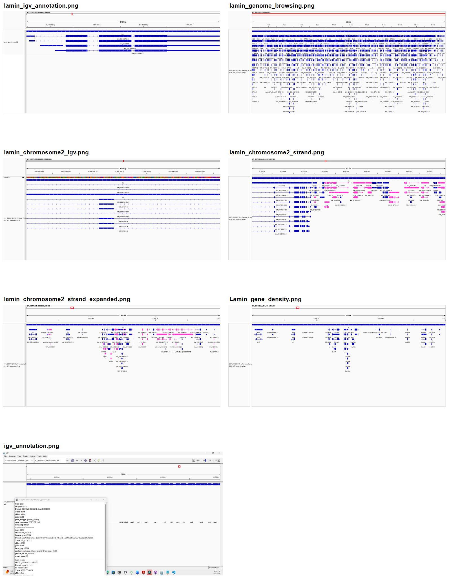

# Week 2: IGV Screenshots

This file collects the IGV screenshots for the Drosophila Lamin analysis in one place.

The image above is a single contact sheet containing all available IGV screenshots.

## Lamin annotation

Detailed view of the *Drosophila melanogaster* Lamin (`Lam`) gene showing transcript isoforms and exon structures.

## Genome browsing view

Wider view of the Lamin locus and surrounding annotated genes.

## Chromosome 2 annotation

Lamin locus at `NT_033779.5:5,542,480-5,546,642`.

## Strand view

Strand coloring distinguishes forward and reverse annotation directions.

## Expanded strand view

Expanded annotation view showing separate transcript and feature rows.

## Gene density view

The 300 kb neighborhood around the Lamin locus, used to assess nearby gene spacing.

## Annotation track view

Additional IGV view of the Lamin annotation track.

## Six reading frames

The six translation frames are inspected in IGV by expanding the sequence data track at:

`NT_033779.5:5,542,480-5,546,642`

The forward-strand frames are `+1`, `+2`, and `+3`. The reverse-complement frames are `-1`, `-2`, and `-3`. The six-frame translation screenshot should be added here after capturing it in IGV.
