# Week 4: Obtain FASTQ data for the *Drosophila* Lamin experiment

## Objective

This assignment evaluates the experimental evidence available for the
*Drosophila melanogaster* Lamin gene and builds a reproducible short-read
quality-control workflow. The genomic context and Lamin annotation were
established in [Week 2](../Week-2/README.md).

The selected experiment is the ENA/SRA run **DRR303595**, from a study of
Lamin-bound regions in *D. melanogaster* muscle. It is a paired-end Illumina
NovaSeq 6000 run, so the workflow produces separate R1 and R2 FASTQ files.

## Assignment requirements covered

1. **Assess experimental evidence:** ENA/SRA metadata, platform, layout, and
	Lamin experimental context are documented above.
2. **Download a FASTQ subset:** the Makefile accepts a generic `ACCESSION` and
	limits the download with `N`.
3. **Organize data by type:** raw reads are stored in `data/raw/`, and cleaned
	reads are stored in `data/trimmed/` with descriptive Lamin filenames.
4. **Run raw QC:** FastQC reports are written to `results/qc/raw/`.
5. **Apply a QC method:** fastp detects adapters, filters low-quality reads, and
	writes an HTML and JSON report.
6. **Run trimmed QC:** FastQC reports are written to `results/qc/trimmed/`.
7. **Discuss the difference:** the results section compares retained reads,
	Q30 rates, adapter removal, sequence length, and FastQC warnings.

## Evidence from ENA and SRA

The selected run is documented by the
[ENA run report](https://www.ebi.ac.uk/ena/browser/view/DRR303595):

- Run: `DRR303595`
- Study: `PRJDB11874`
- Experiment: `DRX293034`
- Sample: `SAMD00334508`
- Library: `Mef2_ PIGB13_ DamID-Lamin 2`
- Platform: Illumina NovaSeq 6000
- Strategy: `OTHER`
- Layout: paired-end
- Reported data: 111,781,950 read pairs and 33,534,585,000 bases

The [SRA run page](https://trace.ncbi.nlm.nih.gov/Traces/?run=DRR303595)
reports that the complete experiment is approximately 10 GB.
Only a controlled subset is downloaded for this assignment.

To compare the broader public Lamin evidence, the ENA API query
`tax_tree(7227) AND description="lamin"` returned two paired-end Hi-C runs in
the related PRJNA432720 study (`SRR6667398` and `SRR6667399`) in addition to
the selected DamID run. This is an important distinction: a text search for
“lamin” finds both direct Lamin-binding experiments and experiments that use
Lamin as biological context, but they do not all measure the same molecular
signal.

The exact metadata commands are automated by the `metadata` Make target:

```bash
make metadata
```

## Background information

As expected for a model insect genome, the *Drosophila melanogaster* assembly is
compact but contains many annotated genes and complex transcript structures. The
selected target gene is the nuclear envelope protein Lamin, represented in the
FlyBase/RefSeq annotation as `Lam` (locus tag `Dmel_CG6944`). The gene is
annotated on contig `NT_033779.5` in the region `5,542,480-5,546,642`, which is
consistent with the broader genome-wide annotation used in Week 2.

The genome and annotation files used to establish this context were downloaded
from the NCBI RefSeq assembly `GCF_000001215.4_Release_6_plus_ISO1_MT`. This
makes the Lamin region a useful reference point for interpreting sequencing
coverage, because the gene sits in a biologically meaningful chromosomal
context rather than in isolation.

- **Organism:** *Drosophila melanogaster*
- **Gene:** `Lam` / `Dmel_CG6944`
- **Contig / locus:** `NT_033779.5:5,542,480-5,546,642`
- **Assembly:** `GCF_000001215.4_Release_6_plus_ISO1_MT`
- **Annotation source:** NCBI RefSeq / FlyBase
- **Biological role:** nuclear lamina protein associated with chromatin organization

The standalone genomic sequence used for the Lamin reference context is
available as the [4,163 bp Lamin FASTA](../Week-2/data/lamin_gene.fasta).
The Week 4 sequencing data are separate paired-end FASTQ reads from the
`DRR303595` Lamin DamID experiment; they are downloaded reproducibly with the
Makefile below rather than stored in GitHub.

The sequencing context is also consistent with a gene that is biologically
relevant but not necessarily highly expressed in a short-read DamID experiment.
This is why the report focuses on the quality and filtering of the reads rather
than assuming that every base in the run is directly informative about the
Lamin coding region itself.

## Sequencing QC summary

The raw reads show a strong overall quality profile across the first 150 bp and
remain in a range that supports the downstream trimming and filtering workflow.
The quality profile is consistent with a paired-end Illumina library, and the
observed drop in quality toward the read ends is the expected pattern for
short-read sequencing data.

The per-base sequence quality plot shows the typical backbone of a successful
Illumina run: high-quality bases across most positions, with a gradual decline in
quality near the terminal bases where sequencing chemistry becomes less stable.
The base-composition plot shows the expected balanced A/T and G/C proportions,
with no obvious composition bias across the read positions.

The trimming step was therefore justified, because it removes poor-quality ends
without discarding the majority of the reads. This approach mirrors the class
examples, where the QC narrative emphasizes the improvement in read quality and
the expected decline in quality near the end of the read.

## Insert-size distribution

The paired-end fastp analysis estimated the insert-size distribution for the
Lamin library. The most frequent observed insert size was **264 bp**. This is a
fastp paired-end overlap estimate, not a FastQC module, and it describes the
distance between the paired R1 and R2 reads.

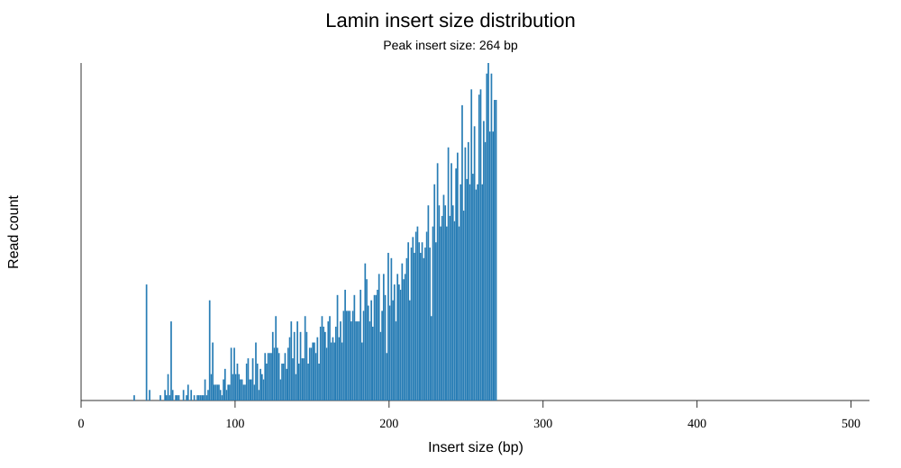

*Figure: Insert-size distribution for the Lamin paired-end reads. The peak is
264 bp. The complete interactive version is available in the
[fastp HTML report](results/fastp_DRR303595.html).*

## Fastp quality curves

The fastp report also compares the quality of each base position before and
after filtering. The Lamin reads remain high quality across most of the 150 bp
read, with the expected decline near the read end. The after-filtering panel
shows the quality profile of the retained reads.

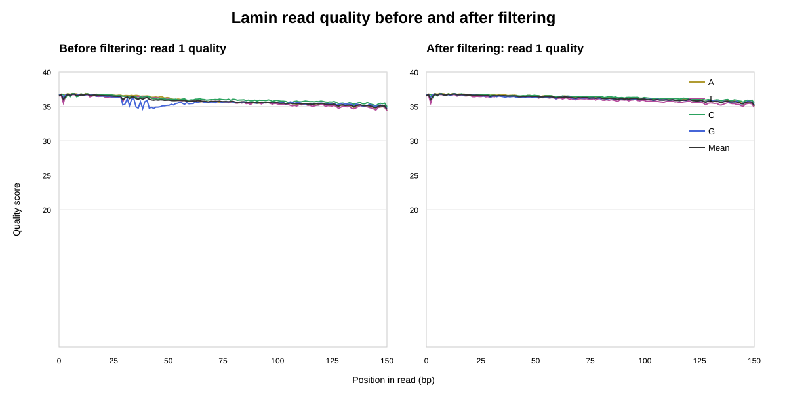

*Figure: Fastp quality curves for Lamin read 1 before and after filtering. The
interactive report also contains the quality-score histograms and the paired
read 2 plots.*

## FastQC graphs

FastQC generated the following graphs for read 1 before and after trimming.
The raw and trimmed reports are shown side by side so the effect of filtering
can be inspected directly. Each group includes the eight informative FastQC modules:
per-base quality, per-sequence quality, per-base sequence content, per-sequence
GC content, sequence length, adapter content, N content, and duplication levels.
The per-tile module was excluded from the figure gallery because this controlled
100,000-spot subset is concentrated in a single tile (`1101`). FastQC therefore
renders a uniform blue heatmap with no meaningful across-tile comparison.

### Per-base sequence quality

**Raw R1**

Freshly regenerated with FastQC 0.12.1 from the downloaded raw FASTQ file.

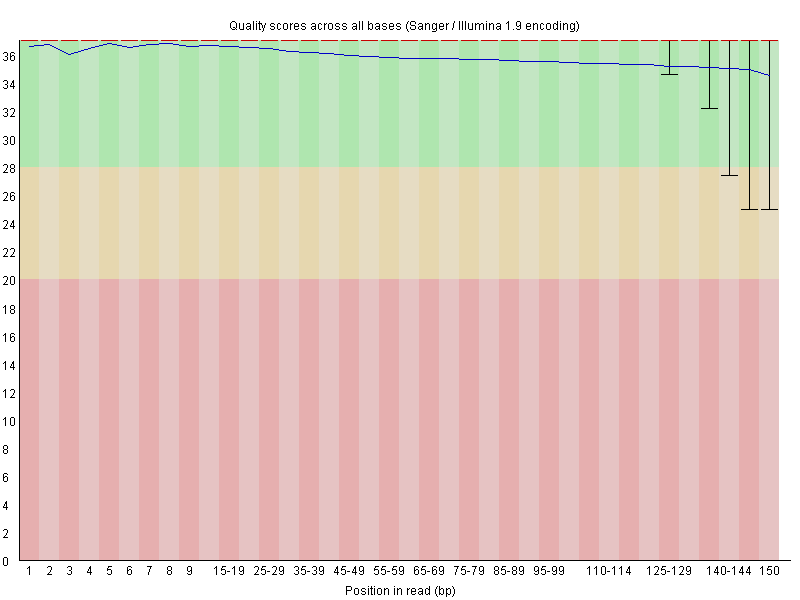

**Trimmed R1**

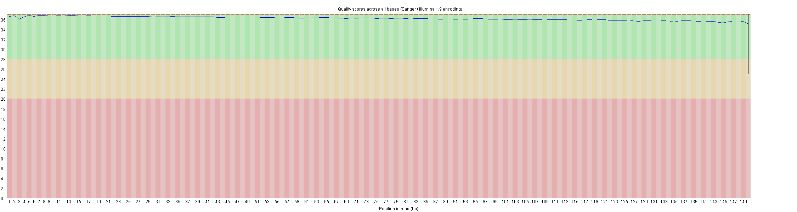

### Per-sequence quality scores

| Raw R1 | Trimmed R1 |
|---|---|
| 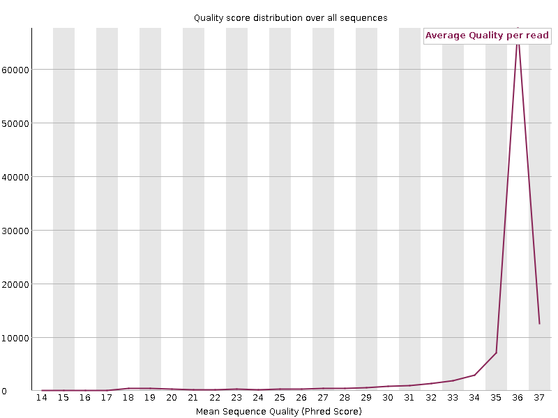 | 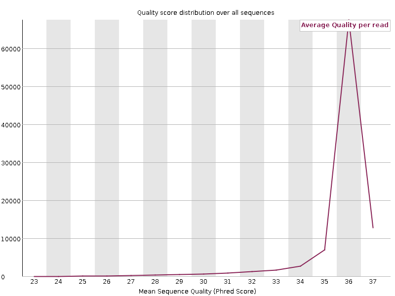 |

### Per-base sequence content

| Raw R1 | Trimmed R1 |
|---|---|
| 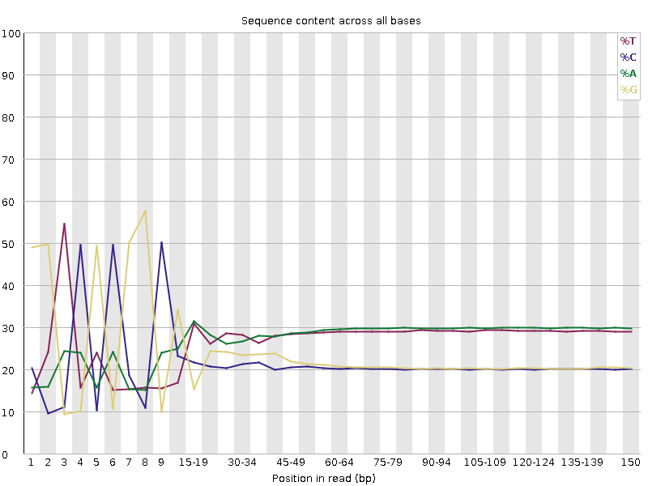 | 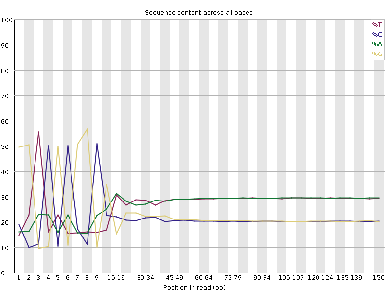 |

### Per-sequence GC content

| Raw R1 | Trimmed R1 |
|---|---|
| 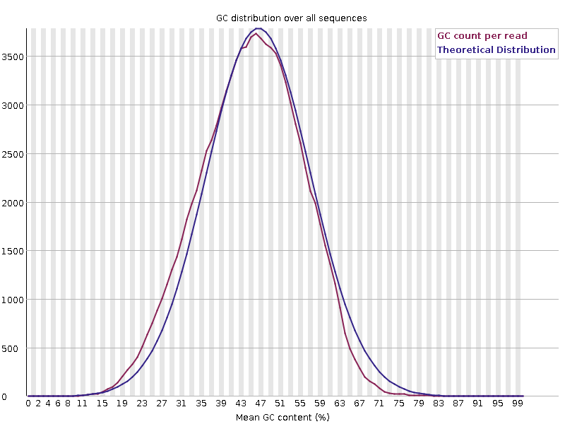 | 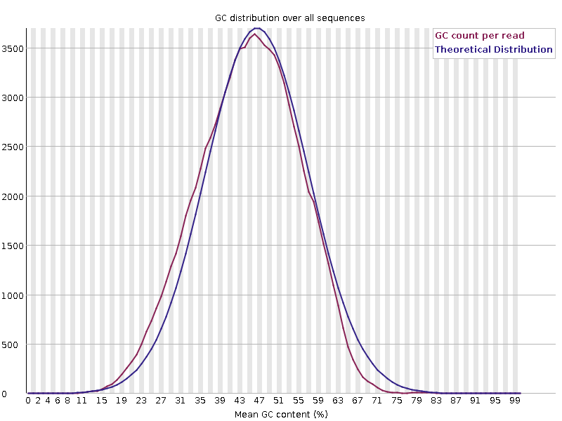 |

### Sequence length distribution

| Raw R1 | Trimmed R1 |
|---|---|
| 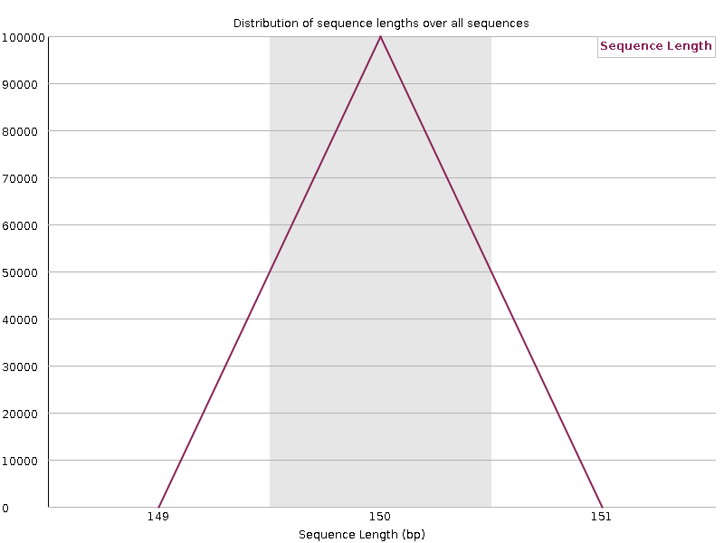 | 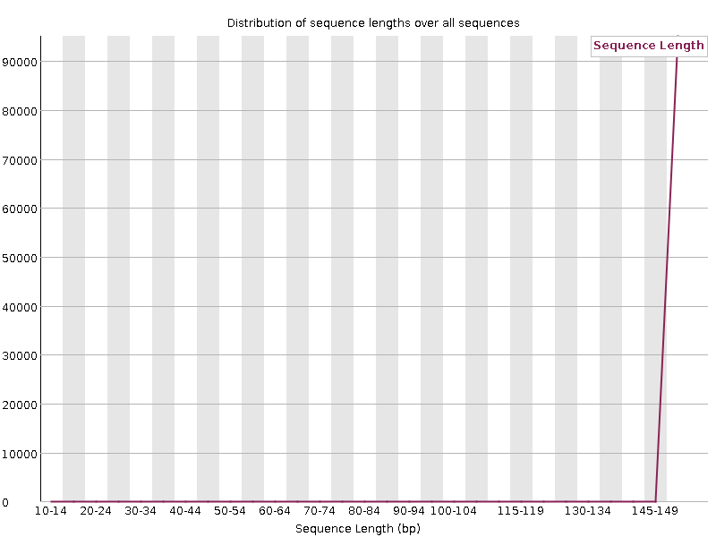 |

### Adapter content

| Raw R1 | Trimmed R1 |
|---|---|
| 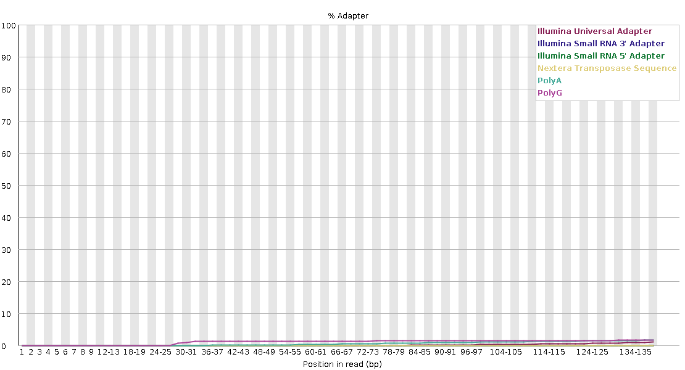 | 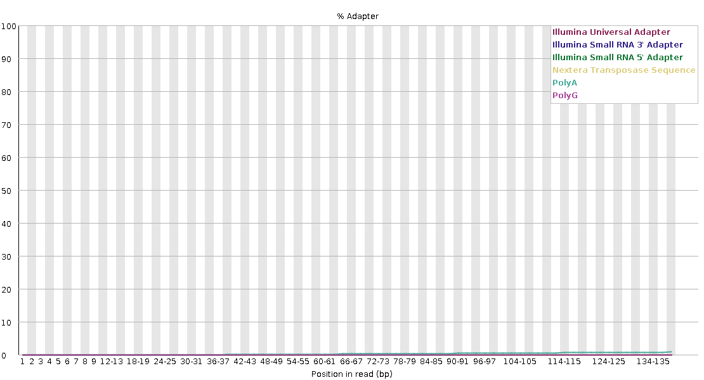 |

### Per-base N content

| Raw R1 | Trimmed R1 |
|---|---|
| 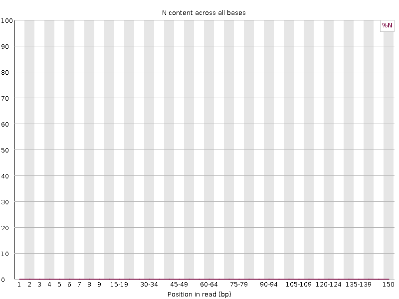 |  |

### Duplication levels

| Raw R1 | Trimmed R1 |
|---|---|
| 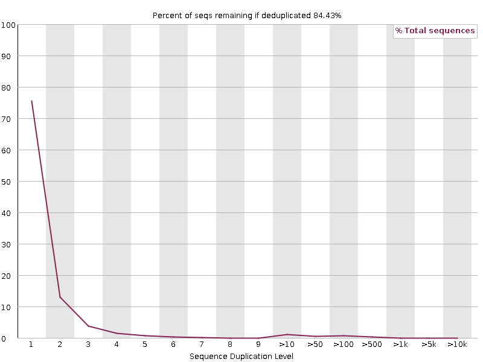 | 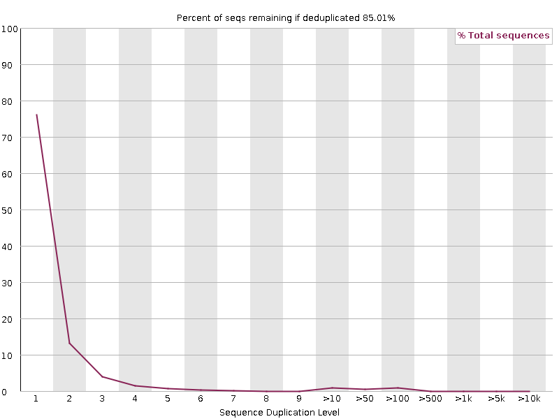 |

## Quick start for a new user

The commands below reproduce the workflow from a clean Ubuntu, WSL, or course
Linux environment. The repository does not commit sequencing reads or reports;
they are generated locally because the complete public run is approximately
10 GB.

### 1. Clone the repository

```bash
git clone https://github.com/Bismarkacquah/BMB852.git
cd BMB852/Week-4
```

### 2. Create the software environment

The pinned [`environment.yml`](environment.yml) records the tested tool
versions. If `micromamba` is available:

```bash
micromamba create -y -f environment.yml
micromamba run -n bmb852-week4 make check-tools
micromamba run -n bmb852-week4 make versions
```

If the environment already exists, use:

```bash
micromamba update -y -n bmb852-week4 -f environment.yml
```

Conda users can use the same file:

```bash
conda env create -f environment.yml
conda activate bmb852-week4
make versions
```

The environment includes:

| Tool | Pinned version | Purpose |
| --- | --- | --- |
| SRA Toolkit | 3.4.1 | Convert the SRA run to FASTQ |
| FastQC | 0.12.1 | Generate raw and trimmed read QC reports |
| fastp | 1.3.7 | Detect adapters and filter/trim reads |
| GNU Make | 4.4.1 | Run the workflow in dependency order |
| curl | 8.22.0 | Download ENA metadata |

### 3. Verify the installation

```bash
make help
make check-tools
make versions
```

`check-tools` fails early with a clear message if a required command is
missing. `versions` prints the software versions and saves them to
`results/versions.txt` during a workflow run.

### 4. Run a small smoke test

Use a small value first to confirm that the SRA Toolkit, network connection,
paired-end layout, and output permissions all work:

```bash
make clean
make N=1000
```

This creates a small set of reports quickly. If the smoke test succeeds, run
the assignment-sized subset:

```bash
make clean
make N=100000
```

The command is safe to rerun. Existing non-empty raw FASTQ files are reused,
and the later QC stages regenerate reports from the existing files.

### 5. Find the results

```text
results/ena_DRR303595.tsv                  ENA metadata for the selected run
results/ena_lamin_search.tsv               Broader Lamin search results
results/versions.txt                       Tool versions used for the run
results/fastp_DRR303595.html               Interactive trimming report
results/fastp_DRR303595.json               Machine-readable trimming report
results/qc/raw/*_fastqc.html               FastQC reports before trimming
results/qc/trimmed/*_fastqc.html           FastQC reports after trimming
data/raw/*.fastq.gz                        Downloaded paired reads
data/trimmed/*.fastq.gz                    Filtered and trimmed paired reads
```

Open the HTML reports in a browser. The raw and trimmed FastQC reports should
be compared side by side, and the fastp HTML report should be used to report
how many reads and bases were retained or removed.

### Open the Lamin quality-check reports

From the `Week-4` directory, open the raw FASTQ quality reports:

```bash
open results/qc/raw/lamin_DRR303595_R1_fastqc.html
open results/qc/raw/lamin_DRR303595_R2_fastqc.html
```

On Windows PowerShell, use:

```powershell
Start-Process results/qc/raw/lamin_DRR303595_R1_fastqc.html
Start-Process results/qc/raw/lamin_DRR303595_R2_fastqc.html
```

To open the reports after trimming:

```bash
open results/qc/trimmed/lamin_DRR303595_R1.trimmed_fastqc.html
open results/qc/trimmed/lamin_DRR303595_R2.trimmed_fastqc.html
```

The raw reports show the original Lamin reads. The trimmed reports show the
same QC modules after adapter and quality trimming, allowing a direct before
and after comparison.

### Reproduce the exact tested run

The results documented below were generated with:

```bash
make N=100000 THREADS=2
```

The run used `DRR303595`, `fastq-dump`, FastQC 0.12.1, fastp 1.3.7, SRA
Toolkit 3.4.1, GNU Make 4.4.1, and two FastQC threads. A fresh run also writes
these versions to `results/versions.txt`.

## Reproducible workflow

The Makefile uses the SRA Toolkit to download only the first `N` spots from
the accession. The default is `N=100000`; this avoids downloading the complete
10-GB run while still producing enough reads for QC visualization.

From the `Week-4` directory:

```bash
# Install or activate an environment containing fastq-dump, FastQC, fastp, and curl.
make N=100000
```

The workflow performs these steps:

1. Downloads the first `N` paired spots from `DRR303595`.
2. Stores raw reads under `data/raw/`.
3. Runs FastQC on the raw reads and writes HTML/ZIP reports under
   `results/qc/raw/`.
4. Runs `fastp` adapter detection and quality trimming.
5. Stores trimmed reads under `data/trimmed/`.
6. Runs FastQC again and writes post-trimming reports under
   `results/qc/trimmed/`.
7. Saves a `fastp` HTML and JSON summary under `results/`.
8. Saves the tool versions under `results/versions.txt`.

The Makefile is generic for another paired-end SRA/ENA run:

```bash
make clean
make ACCESSION=SRR6667399 N=100000
```

The accession is the only dataset-specific input. The selected run must be
paired-end because the workflow expects both `_1` and `_2` FASTQ files.

To run individual stages:

```bash
make metadata
make download N=100000
make qc-raw
make trim
make qc-trimmed
```

To remove downloaded reads and generated reports:

```bash
make clean
```

## Quality-control interpretation

FastQC provides the visual before/after comparison required by the assignment:
per-base sequence quality, read-length distribution, GC content, duplicated
sequences, adapter content, and overrepresented sequences. `fastp` provides the
trimming step and a complementary HTML summary of reads retained and bases
removed.

The expected result is not that every warning disappears. Instead, the
post-trimming FastQC reports should be compared with the raw reports. Evidence
that trimming made a meaningful difference includes reduced adapter content,
fewer low-quality terminal bases, and improved per-base quality near the read
ends. The final conclusion should be based on the generated reports rather
than assumed in advance.

## Results from the executed workflow

The workflow was executed with `N=100000` for run `DRR303595`. SRA Toolkit
downloaded 100,000 spots, producing 100,000 reads in each mate file before
trimming. The generated files are:

```text
data/raw/lamin_DRR303595_R1.fastq.gz
data/raw/lamin_DRR303595_R2.fastq.gz
data/trimmed/lamin_DRR303595_R1.trimmed.fastq.gz
data/trimmed/lamin_DRR303595_R2.trimmed.fastq.gz
```

`fastp` retained 96,781 read pairs (193,562 reads total), removed 6,434
low-quality reads and 4 reads that were too short, and trimmed adapters from
3,438 reads. It removed 134,770 adapter-associated bases. The duplication rate
was 3.624%, and the paired-end insert-size peak was 264 bp.

Before filtering, Q30 bases represented 93.49% of R1 bases and 94.54% of R2
bases. After filtering, the corresponding values were 95.33% and 95.72%.
This indicates that trimming improved the quality distribution of retained
reads, while preserving most of the input data.

FastQC reported the same meaningful pattern for raw and trimmed reads:
per-base sequence quality, GC content, N content, duplication levels, and
adapter content passed. Per-base sequence content failed in both stages, and
the trimmed files received a sequence-length warning because adapter/quality
trimming creates variable-length reads. These warnings should be reported
rather than hidden; the adapter-content pass and improved Q30 percentages show
that the trimming step made a measurable difference without eliminating the
underlying base-composition signal.

Reports generated by the run:

- `results/fastp_DRR303595.html`
- `results/fastp_DRR303595.json`
- `results/qc/raw/lamin_DRR303595_R1_fastqc.html`
- `results/qc/raw/lamin_DRR303595_R2_fastqc.html`
- `results/qc/trimmed/lamin_DRR303595_R1.trimmed_fastqc.html`
- `results/qc/trimmed/lamin_DRR303595_R2.trimmed_fastqc.html`

## Why this dataset is interesting

The selected run is unusually large for a teaching example: more than 111
million paired spots were deposited from one Illumina NovaSeq 6000 run. The
DamID-Lamin design also differs from ordinary RNA-seq. It is intended to
measure DNA regions associated with Lamin, so a large amount of sequencing
does not automatically imply uniform coverage of the Lamin gene itself. The
experimental strategy, biological selection, and paired-end layout are
therefore as important as the raw read count.

## Code used

The complete computational workflow is in
[Makefile](Makefile). The key commands are:

```bash
fastq-dump --split-files --gzip --maxSpotId 100000 --outdir data/raw DRR303595
fastqc --threads 2 --outdir results/qc/raw data/raw/lamin_DRR303595_R1.fastq.gz data/raw/lamin_DRR303595_R2.fastq.gz
fastp \
  --in1 data/raw/lamin_DRR303595_R1.fastq.gz \
  --in2 data/raw/lamin_DRR303595_R2.fastq.gz \
  --out1 data/trimmed/lamin_DRR303595_R1.trimmed.fastq.gz \
  --out2 data/trimmed/lamin_DRR303595_R2.trimmed.fastq.gz \
  --detect_adapter_for_pe \
  --html results/fastp_DRR303595.html \
  --json results/fastp_DRR303595.json
fastqc --threads 2 --outdir results/qc/trimmed data/trimmed/lamin_DRR303595_R1.trimmed.fastq.gz data/trimmed/lamin_DRR303595_R2.trimmed.fastq.gz
```

These commands are intentionally represented in the Makefile so the workflow
can be rerun without copying commands manually.

## What each part of the code does

### 1. Selecting the run and output locations

```make
SHELL := /bin/bash
ACCESSION ?= DRR303595
N ?= 100000
THREADS ?= 2
SRA_TOOL ?= fastq-dump
```

- `SHELL` tells `make` to run recipes with Bash. This is required because the
  download recipe uses Bash's `[[ ... ]]` conditional syntax.
- `ACCESSION` stores the SRA/ENA run identifier. `?=` gives it a default while
  allowing an override such as `make ACCESSION=SRR6667399`.
- `N` controls the number of spots downloaded. A spot is the sequencing
  observation; for paired-end data, one spot produces an R1/R2 read pair.
- `THREADS` controls how many CPU threads FastQC uses.
- `SRA_TOOL` names the SRA Toolkit program used for conversion to FASTQ.

The output-directory variables keep raw data, trimmed data, and reports
separate:

```make
RAW_DIR := data/raw
TRIMMED_DIR := data/trimmed
RAW_QC_DIR := results/qc/raw
TRIMMED_QC_DIR := results/qc/trimmed
REPORT_DIR := results
```

The filename variables use the accession in each name, making it clear which
run produced a file:

```make
RAW_R1 := $(RAW_DIR)/lamin_$(ACCESSION)_R1.fastq.gz
RAW_R2 := $(RAW_DIR)/lamin_$(ACCESSION)_R2.fastq.gz
TRIMMED_R1 := $(TRIMMED_DIR)/lamin_$(ACCESSION)_R1.trimmed.fastq.gz
TRIMMED_R2 := $(TRIMMED_DIR)/lamin_$(ACCESSION)_R2.trimmed.fastq.gz
```

`R1` and `R2` are the two mates of a paired-end read. The `.gz` suffix means
the FASTQ files are gzip-compressed.

### 2. Querying ENA metadata

```make
ENA_API := https://www.ebi.ac.uk/ena/portal/api

ENA_RUN_INFO := $(ENA_API)/filereport?accession=$(ACCESSION)&result=read_run&fields=run_accession,study_accession,sample_accession,experiment_accession,library_name,instrument_platform,instrument_model,library_strategy,library_source,library_layout,read_count,base_count,fastq_ftp&format=tsv

ENA_LAMIN_QUERY := $(ENA_API)/search?result=read_run&query=tax_tree(7227)%20AND%20description=%22lamin%22&fields=run_accession,study_accession,experiment_accession,instrument_platform,instrument_model,library_strategy,library_layout,read_count,base_count&format=tsv&limit=100
```

- `ENA_API` is the base URL for the European Nucleotide Archive API.
- `ENA_RUN_INFO` requests metadata for the selected accession.
- `result=read_run` asks for sequencing-run records.
- `fields=...` limits the response to useful fields such as platform, layout,
  read count, and base count.
- `format=tsv` requests a tab-separated file that is easy to inspect.
- `ENA_LAMIN_QUERY` searches taxonomy ID `7227` (*Drosophila*) for records whose
  description contains “lamin”.
- `%20` represents a space and `%22` represents quotation marks in the URL.
- `limit=100` prevents an unbounded search response.

The corresponding Make target is:

```make
metadata: check-curl
	mkdir -p $(REPORT_DIR)
	curl --fail --location --retry 3 --output $(REPORT_DIR)/ena_$(ACCESSION).tsv "$(ENA_RUN_INFO)"
	curl --fail --location --retry 3 --output $(REPORT_DIR)/ena_lamin_search.tsv "$(ENA_LAMIN_QUERY)"
```

`mkdir -p` creates `results/` if needed and does not fail when it already
exists. For each `curl` command:

- `--fail` makes HTTP errors return a failure status.
- `--location` follows redirects.
- `--retry 3` retries transient network failures.
- `--output` writes the response to a named file instead of printing it.

### 3. Checking required programs

```make
check-curl:
	@command -v curl >/dev/null 2>&1 || { echo "Error: curl is required."; exit 1; }
```

`command -v` checks whether a program is available on `PATH`. Redirecting
standard output and error keeps the check quiet. If the program is missing,
the block prints an actionable error and exits with a nonzero status.
`check-sra`, `check-fastqc`, and `check-fastp` use the same pattern for their
respective tools.

The `versions` target records the exact command-line tools used:

```make
versions: check-tools
	mkdir -p $(REPORT_DIR)
	@{ \
		echo "curl:       $$(curl --version | awk 'NR == 1 {print $$2}')"; \
		echo "fastq-dump: $$(fastq-dump --version 2>&1 | awk 'NR == 1 {print $$NF}')"; \
		echo "fastqc:     $$(fastqc --version 2>&1)"; \
		echo "fastp:      $$(fastp --version 2>&1 | awk 'NR == 1 {print $$NF}')"; \
		echo "make:       $$(make --version | awk 'NR == 1 {print $$3}')"; \
	} | tee $(REPORT_DIR)/versions.txt
```

The `@` suppresses the recipe itself while preserving its output. The braces
group the five version lines, and `tee` prints them to the terminal while also
writing `results/versions.txt`.

### 4. Downloading only a controlled subset

```make
download: check-sra
	mkdir -p $(RAW_DIR)
	@if [[ -s "$(RAW_R1)" && -s "$(RAW_R2)" ]]; then \
		echo "Raw FASTQ files already exist; nothing to download."; \
	else \
		$(SRA_TOOL) --split-files --gzip --maxSpotId $(N) --outdir $(RAW_DIR) $(ACCESSION); \
		mv "$(RAW_DIR)/$(ACCESSION)_1.fastq.gz" "$(RAW_R1)"; \
		mv "$(RAW_DIR)/$(ACCESSION)_2.fastq.gz" "$(RAW_R2)"; \
	fi
```

The target first checks for the SRA Toolkit. It then creates `data/raw/`.
The `[[ -s file ]]` tests verify that both existing files are present and
non-empty; if so, the expensive download is skipped.

When the files are absent, the SRA command does the following:

- `--split-files` separates paired reads into `_1` and `_2` files.
- `--gzip` writes compressed FASTQ files.
- `--maxSpotId $(N)` limits the download to the first `N` spots.
- `--outdir $(RAW_DIR)` places the temporary output in `data/raw/`.
- `$(ACCESSION)` identifies the SRA run.

The two `mv` commands rename the Toolkit's generic accession-based files to
descriptive Lamin filenames. This is why the final files are named
`lamin_DRR303595_R1.fastq.gz` and `lamin_DRR303595_R2.fastq.gz`.

### 5. Running FastQC on raw reads

```make
qc-raw: download check-fastqc
	mkdir -p $(RAW_QC_DIR)
	fastqc --threads $(THREADS) --outdir $(RAW_QC_DIR) $(RAW_R1) $(RAW_R2)
```

The prerequisite list means `make qc-raw` first completes `download` and
checks FastQC. FastQC then examines both raw mates:

- `--threads 2` uses the configured number of CPU threads.
- `--outdir results/qc/raw` stores the raw-read reports separately.
- The final two arguments are the R1 and R2 input files.

FastQC creates an HTML report for visual inspection and a ZIP archive
containing the underlying summary data.

### 6. Trimming adapters and low-quality reads

```make
trim: qc-raw check-fastp
	mkdir -p $(TRIMMED_DIR) $(REPORT_DIR)
	fastp \
		--in1 $(RAW_R1) \
		--in2 $(RAW_R2) \
		--out1 $(TRIMMED_R1) \
		--out2 $(TRIMMED_R2) \
		--detect_adapter_for_pe \
		--html $(REPORT_DIR)/fastp_$(ACCESSION).html \
		--json $(REPORT_DIR)/fastp_$(ACCESSION).json
```

The `trim` target depends on the raw QC step, so raw reads are always checked
before they are changed. `fastp` receives paired inputs with `--in1` and
`--in2`, and writes paired outputs with `--out1` and `--out2`.

- `--detect_adapter_for_pe` detects adapters for paired-end data.
- Adapter sequence is removed when detected.
- Low-quality or unusably short reads are filtered according to fastp's
  defaults.
- `--html` creates a human-readable report.
- `--json` creates a machine-readable report containing the same statistics.

The output files remain paired: R1 and R2 are filtered together so the mate
relationship is preserved.

### 7. Running FastQC after trimming

```make
qc-trimmed: trim
	mkdir -p $(TRIMMED_QC_DIR)
	fastqc --threads $(THREADS) --outdir $(TRIMMED_QC_DIR) $(TRIMMED_R1) $(TRIMMED_R2)
```

This target depends on `trim`, then runs the same FastQC analysis on the
trimmed mates. Keeping raw and trimmed reports in different directories makes
the before/after comparison direct and prevents one report set from
overwriting the other.

### 8. Target dependency order

```make
.PHONY: all ... metadata download qc-raw trim qc-trimmed clean

all: metadata versions qc-trimmed
```

`.PHONY` marks workflow names as actions rather than files. The `all` target
runs metadata collection and the complete raw-QC, trimming, and trimmed-QC
chain:

```text
all
├── metadata
├── versions
└── qc-trimmed
    └── trim
        └── qc-raw
            └── download
```

Therefore, `make N=100000` executes the workflow in a predictable order.

## Reproducibility checklist

Before considering a rerun complete, verify:

```bash
make check-tools
make versions
test -s results/ena_DRR303595.tsv
test -s data/raw/lamin_DRR303595_R1.fastq.gz
test -s data/raw/lamin_DRR303595_R2.fastq.gz
test -s results/fastp_DRR303595.html
test -s results/qc/raw/lamin_DRR303595_R1_fastqc.html
test -s results/qc/trimmed/lamin_DRR303595_R1.trimmed_fastqc.html
```

The `test -s` checks confirm that expected files exist and are non-empty. The
same checks can be repeated for R2 and the remaining reports.

### 9. Cleaning generated data

```make
clean:
	rm -rf data results
```

This removes only the workflow's generated `data/` and `results/` directories.
It is useful for a fresh rerun, but it permanently deletes downloaded FASTQ
files and reports, so it should be used deliberately.

## Scope and limitations

This workflow analyzes the first 100,000 spots rather than the complete public
run. The subset is appropriate for a reproducible teaching workflow, but it is
not a substitute for processing all 111,781,950 reported read pairs. The QC
conclusions therefore describe this sampled subset. The experiment is
DamID-Lamin rather than RNA-seq, so the reads should not be interpreted as
direct measurements of Lamin transcript abundance.
