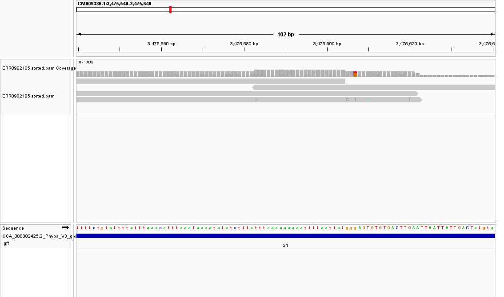
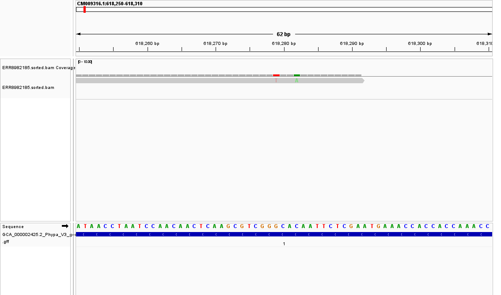
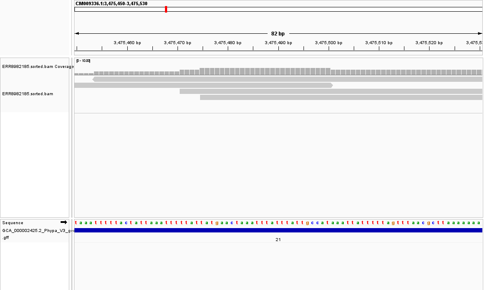
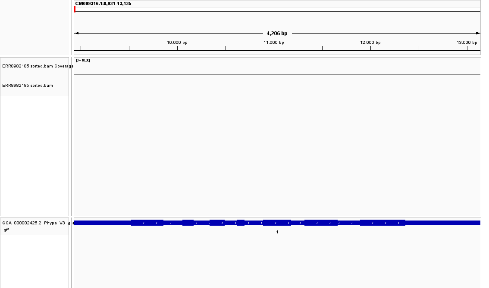

# Assignment 5

## Organism

This assignment examines whole-genome reads from the moss
*Physcomitrium patens*. The alignment uses the matching reference assembly
and the paired-end reads trimmed in Week 4.

- Assembly: `GCA_000002425.2_Phypa_V3`
- Genome: `fasta/GCA_000002425.2_Phypa_V3_genomic.fna`
- Annotation: `../Week-2/data/GCA_000002425.2_Phypa_V3_genomic.gff`
- Reads: `../Week-4/data/trimmed/ERR8982185_1.trimmed.fastq.gz` and `_2.trimmed.fastq.gz`

The reference, annotation, and reads all come from *P. patens*.

| Sequencing record | Accession or value |
| --- | --- |
| Study | `PRJEB51295` |
| Experiment | `ERX8525940` |
| Sample | `SAMEA13207856` |
| Run | `ERR8982185` |
| Platform | Illumina NovaSeq 6000 |
| Library | Paired-end whole-genome sequencing |

These identifiers are recorded in the saved [Week 4 metadata](../Week-4/results/ena_ERR8982185.tsv).

## Reproduce this assignment

Use Linux, macOS, or WSL for the command-line analysis. Install Conda or
Mamba first; install IGV Desktop separately for screenshots. The environment
file pins the main analysis tools. The saved screenshots used IGV 2.19.8.
Allow several GB of disk space for the reference, indexes, and temporary files.
The default analysis uses only the first 1,000 spots of `ERR8982185`.

```bash
# Download this repository, including the scripts and report.
git clone https://github.com/Bismarkacquah/BMB852.git
# Enter the assignment folder so relative Makefile paths resolve correctly.
cd BMB852/Week-5
# Install the command-line tools in an isolated environment.
conda env create -f environment.yml
# Select that environment for subsequent commands.
conda activate week5-moss
# Retrieve missing moss reference/annotation and download and trim the read subset.
make setup
# Verify that alignment programs and all input files are available.
make check-tools check-inputs
# Build reference indexes, align, sort, index, and calculate compact statistics.
make all THREADS=2
# Show depth statistics and the estimate of read pairs required for 10x coverage.
make estimate
# Recreate the mismatch evidence and the two regional pileup files.
make audit
# Generate a batch script with paths specific to your checkout.
make igv
```

Open IGV and choose **Tools > Run Batch Script**, selecting the generated
`scripts/igv_local_batch.txt`. On WSL with Windows IGV, generate Windows-visible
paths instead, replacing the example directory with your checkout:

```bash
python3 scripts/prepare_igv.py --igv-root C:/path/to/BMB852/Week-5
```

`make setup` reuses nonempty inputs from Weeks 2 and 4. For a clean reproduction,
use a fresh clone so older local inputs cannot change the result. Subsequent
`make all` calls rebuild only outdated targets. The default no longer creates
the 10 GB all-position depth table. Reference length from the FASTA index
ensures uncovered positions still contribute to the genome-wide mean.

The [input checksums](provenance/inputs.sha256) identify the files used for
this report. From `Week-5`, run `sha256sum -c provenance/inputs.sha256` to
check an exact copy. Gzip container metadata can differ between fresh runs
even when decompressed read sequences agree. The [Samtools version record](provenance/samtools-version.txt)
records the alignment-processing version used during validation.

Rebuilding the alignment from the existing inputs produced the same statistics.
A second `make all` skipped the completed outputs. The fresh-download and
Conda installation steps have not been tested end to end.

The [complete code walkthrough](CODE_WALKTHROUGH.md) includes every line of
the setup, analysis, summary, and IGV scripts with explanations. Input download
locations follow the [NCBI genome file layout](https://www.ncbi.nlm.nih.gov/datasets/docs/v2/data-processing/policies-annotation/genomeftp/).

## Makefile

The complete [Makefile](Makefile) is shown below. Comments explain each setting
and recipe. Recipes begin with a tab. `:=` defines a variable, `?=` supplies an
overridable default, `$<` is the first input prerequisite, and `$@` is the output
target. A target's prerequisites follow its colon. `|` streams one command's
output into another, and `>` writes output to a file.

```makefile
# Execute recipes in Bash and stop if any command in a pipeline fails.
SHELL := /bin/bash
.SHELLFLAGS := -eu -o pipefail -c
# A plain make runs the analysis rather than only printing help.
.DEFAULT_GOAL := all
# Remove incomplete target files after a failed recipe.
.DELETE_ON_ERROR:
# Moss reference and trimmed paired-end inputs.
REFERENCE := fasta/GCA_000002425.2_Phypa_V3_genomic.fna
ANNOTATION := ../Week-2/data/GCA_000002425.2_Phypa_V3_genomic.gff
READ1 := ../Week-4/data/trimmed/ERR8982185_1.trimmed.fastq.gz
READ2 := ../Week-4/data/trimmed/ERR8982185_2.trimmed.fastq.gz
# Name alignment and coverage outputs once for reuse below.
BAM := bam/ERR8982185.sorted.bam
STATS := bam/ERR8982185.flagstat.txt
COVERAGE := coverage/ERR8982185.coverage.tsv
DEPTH := coverage/ERR8982185.covered_depth.tsv
SUMMARY := coverage/ERR8982185.depth_summary.json
# Allow the thread count to be overridden, for example make THREADS=4.
THREADS ?= 2
# These names are commands, not files that Make should look for.
.PHONY: all setup check-tools check-inputs reference index align sort index-bam stats coverage depth estimate igv
# Build compact summaries; the 10 GB all-position depth file is unnecessary.
all: $(STATS) $(COVERAGE) $(SUMMARY)
# Download missing inputs without replacing existing nonempty input files.
setup:
	bash scripts/prepare_inputs.sh
# Check the tools used for alignment and summarization.
check-tools:
	command -v bwa
	command -v samtools
	command -v python3
# Verify all four required inputs are nonempty.
check-inputs:
	test -s $(REFERENCE)
	test -s $(ANNOTATION)
	test -s $(READ1)
	test -s $(READ2)
# Keep convenient names for individual stages.
reference: $(REFERENCE).fai
index: $(REFERENCE).bwt
align sort: $(BAM)
index-bam: $(BAM).bai
stats: $(STATS)
coverage: $(COVERAGE)
depth: $(DEPTH)
estimate: $(SUMMARY)
	cat $(SUMMARY)
# BWA builds its companion index files from the reference FASTA.
$(REFERENCE).bwt: $(REFERENCE)
	bwa index $<
# Samtools makes the random-access FASTA index needed by IGV.
$(REFERENCE).fai: $(REFERENCE)
	samtools faidx $<
# Map paired reads and stream alignments directly into coordinate sorting.
$(BAM): $(REFERENCE).bwt $(REFERENCE).fai $(READ1) $(READ2)
	mkdir -p bam
	bwa mem -t $(THREADS) $(REFERENCE) $(READ1) $(READ2) | samtools sort -@ $(THREADS) -o $@
	samtools quickcheck $@
# Index the sorted BAM for region queries and IGV navigation.
$(BAM).bai: $(BAM)
	samtools index $<
# Write alignment-flag counts and percentages.
$(STATS): $(BAM) $(BAM).bai
	samtools flagstat $(BAM) > $@
# Write one coverage summary row per reference sequence.
$(COVERAGE): $(BAM) $(BAM).bai
	mkdir -p coverage
	samtools coverage $(BAM) > $@
# Write sparse position depths; the FASTA index supplies the whole-genome denominator.
$(DEPTH): $(BAM) $(BAM).bai
	mkdir -p coverage
	samtools depth $(BAM) > $@
# Calculate exact depth statistics and the read-pair estimate from the inputs.
$(SUMMARY): $(DEPTH) $(REFERENCE).fai $(READ1) $(READ2) scripts/summarize_depth.py
	python3 scripts/summarize_depth.py
# Generate an IGV batch file containing paths for this checkout.
igv:
	python3 scripts/prepare_igv.py

# Recreate selected-region base observations and read-support pileups.
.PHONY: audit
audit: $(BAM).bai $(REFERENCE).fai
	python3 scripts/audit_mismatches.py
	samtools mpileup -B -Q 0 -f $(REFERENCE) -r CM009336.1:3475540-3475640 $(BAM) > bam/ERR8982185.zoom.pileup.txt
	samtools mpileup -B -Q 0 -f $(REFERENCE) -r CM009316.1:618250-618310 $(BAM) > bam/ERR8982185.read_end.pileup.txt
```

### Confirm the generated files

```bash
# List sorted alignments, indexes, and saved statistics.
ls bam/
# List the matching reference FASTA and generated reference indexes.
ls fasta/
# List per-contig coverage, sparse depths, and the JSON summary.
ls coverage/
# Read the complete alignment statistics report.
cat bam/ERR8982185.flagstat.txt
```

## Coverage target

The genome is approximately 471,852,792 bp. Each trimmed read pair contributes
about 292.43 bases on average (291,554 bases across 997 pairs). The estimated
number of read pairs needed for 10x coverage is:

```text
Mean bases per trimmed pair = 291,554 / 997 = approximately 292.43 bp
10 x 471,852,792 / (291,554 / 997) = approximately 16,135,510 read pairs
```

The available teaching subset contains 997 trimmed pairs, so this BAM is a
workflow demonstration rather than a 10x genome-wide analysis. This estimate
assumes all sequenced bases contribute to coverage; mapping losses would
increase the number of pairs needed.

## BAM statistics

The saved [Samtools flagstat report](bam/ERR8982185.flagstat.txt) gave:

```text
1998 + 0 in total (QC-passed reads + QC-failed reads)
1994 + 0 primary
0 + 0 secondary
4 + 0 supplementary
0 + 0 duplicates
0 + 0 primary duplicates
1517 + 0 mapped (75.93% : N/A)
1513 + 0 primary mapped (75.88% : N/A)
1994 + 0 paired in sequencing
997 + 0 read1
997 + 0 read2
1450 + 0 properly paired (72.72% : N/A)
1480 + 0 with itself and mate mapped
33 + 0 singletons (1.65% : N/A)
28 + 0 with mate mapped to a different chr
19 + 0 with mate mapped to a different chr (mapQ>=5)
```

Of all alignment records, 75.93% were mapped; among primary records,
1513 of 1994 (75.88%) were mapped to the matching moss reference. The properly
paired percentage was 72.72%. Duplicate marking is not part of this workflow,
so zero duplicate flags does not establish that the sample has no duplicates.

## Check coverage

Run from `Week-5`:

```bash
samtools coverage bam/ERR8982185.sorted.bam > coverage/ERR8982185.coverage.tsv
cat coverage/ERR8982185.coverage.tsv
```

First ten reference sequences from the saved output:

```text
#rname	startpos	endpos	numreads	covbases	coverage	meandepth	meanbaseq	meanmapq
CM009316.1	1	30242098	85	11385	0.0376462	0.000393623	37.3	54.4
CM009317.1	1	25998084	72	9883	0.0380143	0.000391183	37.4	52.9
CM009318.1	1	25551832	76	10757	0.0420987	0.000427367	37.6	54
CM009319.1	1	22344759	56	6858	0.0306918	0.000308797	37.5	52.4
CM009320.1	1	20681290	52	7219	0.0349059	0.000358247	35.7	58.1
CM009321.1	1	19533230	46	6308	0.0322937	0.000341674	36.9	57
CM009322.1	1	18116774	81	10724	0.0591938	0.000644486	36.6	59
CM009323.1	1	17934281	68	9247	0.0515605	0.000521571	37.9	55.6
CM009324.1	1	17794193	49	6088	0.0342134	0.000371582	38.2	52
CM009325.1	1	17530623	59	8297	0.0473286	0.000478477	38.2	56.7
```

The [complete coverage table](coverage/ERR8982185.coverage.tsv) includes all
reference sequences. `coverage` is the percentage of bases covered, whereas
`meandepth` is the average number of aligned bases per reference position.

### Mean depth across the entire genome

The FASTA index gives a total reference length of **471,852,792 bases**.
Generate the depth table and summarize it using that length, including
uncovered positions in the denominator:

```bash
samtools depth bam/ERR8982185.sorted.bam > coverage/ERR8982185.covered_depth.tsv
awk 'NR==FNR {genome += $2; next} {total += $3} END {printf "Mean genome depth: %.9fx\n", total/genome}' \
  fasta/GCA_000002425.2_Phypa_V3_genomic.fna.fai coverage/ERR8982185.covered_depth.tsv
```

Output:

```text
Mean genome depth: 0.000450753x
```

This produces the same whole-genome denominator as including all zero-depth
positions, without requiring the approximately 10.1 GB `depth -aa` table.

### Mean depth only across covered bases

```bash
awk '$3 > 0 {total += $3; covered++} END {printf "Mean depth over covered bases: %.6fx\n", total/covered}' \
  coverage/ERR8982185.covered_depth.tsv
```

Output:

```text
Mean depth over covered bases: 1.048127x
```

| Metric | Result |
| --- | ---: |
| Reference length | 471,852,792 bp |
| Covered reference bases | 202,923 bp |
| Percentage covered | 0.043006% |
| Sum of per-base depths | 212,689 |
| Mean depth across the genome | 0.000450753x |
| Mean depth at covered bases | 1.048127x |
| Maximum observed depth | 4x |

These results were recalculated from the BAM with Samtools. The
[depth summary](coverage/ERR8982185.depth_summary.json) records the values.
Coverage is sparse because only 997 trimmed pairs were aligned to a roughly
472 Mb reference. The mapped percentage and the percentage of the genome
covered describe different quantities.

## IGV visualization

The four views below show the moss BAM against its matching FASTA reference
and GFF annotation in IGV 2.19.8. They cover a mismatch cluster, two differences
near a read end, a region with four overlapping reads, and an uncovered gene
locus.

### Load the FASTA and BAM

1. In IGV, use **Genomes > Load Genome from File** and select
   `fasta/GCA_000002425.2_Phypa_V3_genomic.fna`.
2. Use **File > Load from File** to select `bam/ERR8982185.sorted.bam`.
   Keep `ERR8982185.sorted.bam.bai` beside the BAM.
3. Load `../Week-2/data/GCA_000002425.2_Phypa_V3_genomic.gff` as the annotation.
4. Enter each coordinate below in the search box.

Run `make igv` to generate a batch script for your checkout. It reproduces
the four displayed views through **Tools > Run Batch Script**. IGV supports
[batch snapshots](https://igv.org/doc/desktop/UserGuide/saving_images/).

### Color key

A is green, C is blue, G is yellow/orange, and T is red. Matching read bases
are gray. Low-quality mismatches are faded by IGV's quality shading; this is
why some letters remain pale even after zooming. See the
[IGV alignment display guide](https://igv.org/doc/desktop/UserGuide/tracks/alignments/viewing_alignments_basics/).

### Base-level analysis: colored mismatches

Coordinate: `CM009336.1:3,475,540-3,475,640`



This close-up shows individual reference letters and colored mismatches in
read `ERR8982185.84`. All five mismatching bases have base quality **Q12**,
although the read has mapping quality **60**. Mapping quality describes
confidence in placement; base quality describes confidence in a particular
base call. The other reads at these positions match the reference.

| Position | Reference > read base | Reads supporting difference / depth | Base quality |
| --- | --- | ---: | ---: |
| 3,475,583 | T > G | 1 / 4 | 12 |
| 3,475,605 | G > C | 1 / 3 | 12 |
| 3,475,607 | G > T | 1 / 3 | 12 |
| 3,475,610 | T > A | 1 / 3 | 12 |
| 3,475,620 | G > T | 1 / 3 | 12 |

All five differences occur on the same read. Low base quality and limited supporting reads make it weak evidence
for a true variant. These observations are not variant calls.

### Base-level analysis: read-end mismatches

Coordinate: `CM009316.1:618,250-618,310`



The read has a **G > T** difference at 618,279 (Q8) and a **C > A** difference
at 618,282 (Q12), near its alignment end. Each position has only one covering
read. The colored letters are visible at this zoom, but there is no second
read supporting either difference.

### Base-level analysis: four overlapping reads

Coordinate: `CM009336.1:3,475,450-3,475,530`



The coverage reaches **4x** within this interval. The aligned bases match the
reference in this window, so the reads remain gray. The colored reference
letters below identify the DNA sequence; they do not indicate variants.
More overlapping reads do not necessarily mean more mismatches.

### Reproduce and interpret the close-ups

Run the generated `scripts/igv_local_batch.txt` in IGV through
**Tools > Run Batch Script**.
IGV shades the bases by their quality scores.

The [mismatch audit](bam/ERR8982185.zoom_mismatches.tsv) records mismatches
from the two selected neighborhoods, including read names and quality scores.
The [cluster pileup](bam/ERR8982185.zoom.pileup.txt) and
[read-end pileup](bam/ERR8982185.read_end.pileup.txt) provide per-position
support. Recreate these from `Week-5` with:

```bash
samtools mpileup -B -Q 0 -f fasta/GCA_000002425.2_Phypa_V3_genomic.fna \
  -r CM009336.1:3475540-3475640 bam/ERR8982185.sorted.bam \
  > bam/ERR8982185.zoom.pileup.txt
samtools mpileup -B -Q 0 -f fasta/GCA_000002425.2_Phypa_V3_genomic.fna \
  -r CM009316.1:618250-618310 bam/ERR8982185.sorted.bam \
  > bam/ERR8982185.read_end.pileup.txt
```

These inspection commands retain low-quality bases (`-Q 0`) and disable
alignment-based base-quality adjustment (`-B`) to inspect the original calls.
They are not a variant-calling pipeline.

### Annotation context: selected gene locus

Coordinate: `CM009316.1:8,931-13,135`



The GFF track shows annotations at the `PHYPA_000001` locus.
The annotation track contains features, while the BAM and coverage tracks
are empty in this interval. This is consistent with the small WGS subset;
absence of mapped reads here does not establish a gene deletion or lack of
expression.

## Folder layout

The assignment files are organized as follows:

```text
Week-5/
|-- bam/          BAM, index, and alignment statistics
|-- fasta/        reference FASTA and indexes
|-- screenshots/  nine saved IGV images
|-- coverage/     coverage and depth tables
|-- scripts/      IGV batch scripts
|-- Makefile      reproducible workflow
`-- README.md     assignment report
```

| File or folder | Contents |
| --- | --- |
| [bam/](bam/) | Alignment statistics and instructions for generating the BAM and index |
| [fasta/](fasta/) | Reference genome setup instructions |
| [screenshots/](screenshots/) | Three base-level close-ups and six earlier views |
| [Makefile](Makefile) | Commands to reproduce the alignment and coverage analysis |
| [coverage/](coverage/) | Coverage output instructions |
| [scripts/](scripts/) | IGV batch scripts used to capture the views |

The reference FASTA, BAM, indexes, and large depth tables are generated locally
and ignored by Git. Folder READMEs explain how to recreate them. Alignment
statistics, the small coverage table, the depth summary, and screenshots
accompany the report.

## Summary

75.88% of the primary reads from *Physcomitrium patens* run
`ERR8982185` aligned to the moss reference genome, and 72.72% were properly
paired. Coverage was sparse: only about 0.043% of the genome was covered,
with an average depth of 0.000451x across the entire reference and 1.048x
across covered bases. This reflects the small teaching subset of 997 read
pairs. In IGV, the gray blocks show mapped reads, while colored bases mark
differences from the reference. The close-ups show individual mismatches,
a region reaching 4x depth, and an annotated locus without mapped reads.
Base-level inspection found low-quality mismatches (Q8-Q12) supported by
only one read at each inspected position. Other overlapping reads in the
cluster match the reference. These differences are weak evidence for true
variation and should not be reported as confirmed variants. More reads
are needed to reach 10x genome-wide coverage and assess possible variants
reliably.
