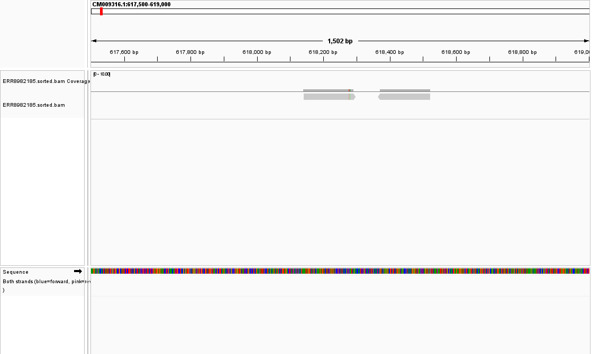
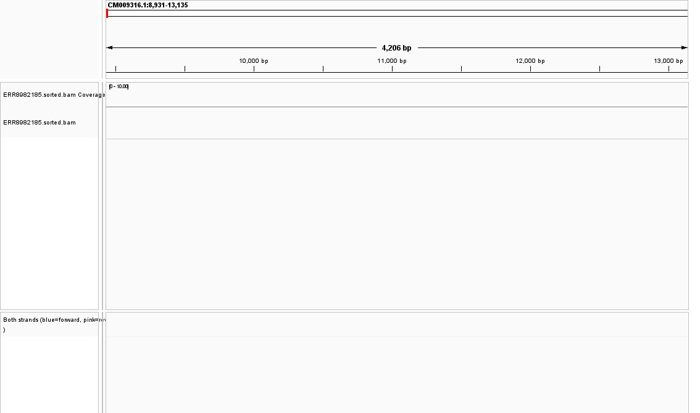
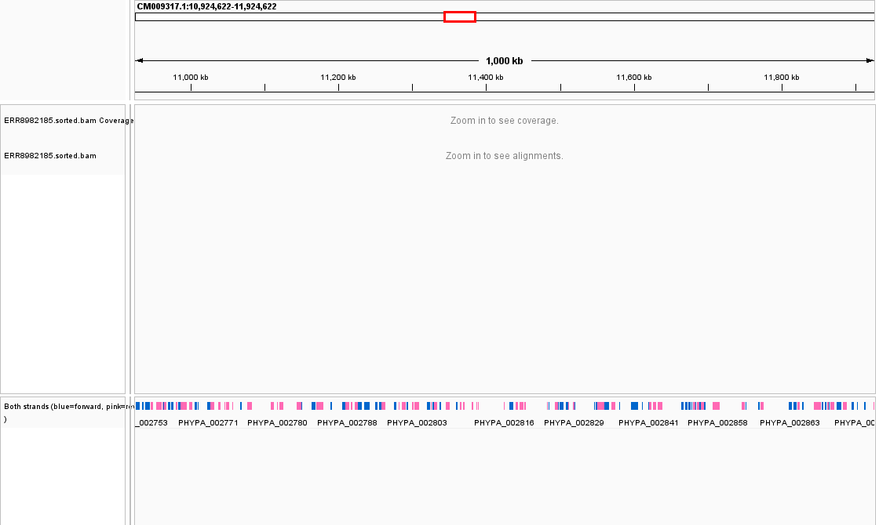

# Week 5: Generate a BAM file for *Physcomitrium patens*

## Objective

This assignment aligns paired-end reads from Week 4 to the matching
*Physcomitrium patens* genome from Week 2. The workflow creates a sorted and
indexed BAM file, reports alignment statistics, and prepares the result for IGV
visualization.

The same organism and assembly are used throughout:

- Genome: `../Week-2/data/GCA_000002425.2_Phypa_V3_genomic.fna`
- Annotation: `../Week-2/data/GCA_000002425.2_Phypa_V3_genomic.gff`
- Reads: `../Week-4/data/trimmed/ERR8982185_1.trimmed.fastq.gz` and `_2.trimmed.fastq.gz`
- Assembly: `GCA_000002425.2_Phypa_V3`

The reference and reads are referenced in place rather than copied into Week 5.

## Coverage estimate

The genome contains approximately 471,852,792 bp. The trimmed Week-4 subset
contains about 292.7 kb per paired spot. The approximate number of pairs for
10x theoretical coverage is:

$$N = \frac{10 \times 471,852,792}{292,665} \approx 16,122\text{ read pairs}$$

Only 997 trimmed pairs are currently available from the Week-4 teaching subset,
so they provide far less than 10x genome-wide coverage. The assignment-sized
subset should therefore be downloaded before running the full alignment if a
10x target is required. The Makefile records this estimate with `make estimate`.

## Assignment workflow

The Makefile provides these stages:

```bash
make check-tools
make check-inputs
make estimate
make index
make align
make sort
make index-bam
make stats
make depth
```

Or run the complete BAM/statistics workflow with:

```bash
make all THREADS=2
```

Required tools are `bwa`, `samtools`, and GNU Make. Run `make check-tools`
before starting. The alignment was executed in WSL Ubuntu after installing
these tools.

The alignment command is intentionally simple and reproducible:

```bash
bwa index ../Week-2/data/GCA_000002425.2_Phypa_V3_genomic.fna
bwa mem -t 2 ../Week-2/data/GCA_000002425.2_Phypa_V3_genomic.fna \
   ../Week-4/data/trimmed/ERR8982185_1.trimmed.fastq.gz \
   ../Week-4/data/trimmed/ERR8982185_2.trimmed.fastq.gz \
   | samtools sort -@ 2 -o results/alignments/ERR8982185.sorted.bam
samtools index results/alignments/ERR8982185.sorted.bam
samtools flagstat results/alignments/ERR8982185.sorted.bam \
   > results/alignments/ERR8982185.flagstat.txt
```

The Makefile runs the same stages through dependencies, so `make all` is the
preferred reproducible command.

## Output files

After a successful run, the workflow creates:

```text
results/alignments/ERR8982185.sorted.bam
results/alignments/ERR8982185.sorted.bam.bai
results/alignments/ERR8982185.flagstat.txt
results/coverage/ERR8982185.depth.tsv
```

The BAM is coordinate-sorted, and the `.bai` index allows IGV to jump quickly
to selected genomic coordinates.

## Statistics and interpretation

The `samtools flagstat` report answers:

- What percentage of reads aligned?
- How many reads were properly paired?
- How many reads were secondary, supplementary, duplicate, or failed QC?

The alignment percentage should be compared with the expected organism match.
Because these are *P. patens* reads mapped to a *P. patens* reference, a very
low alignment rate would suggest a problem with read quality, contamination,
the assembly choice, or the alignment command.

The depth file contains per-position coverage. Coverage is not expected to be
perfectly uniform: repetitive regions, GC bias, library preparation, and
sampling depth can create peaks and gaps. The Week-4 subset is too small for a
meaningful genome-wide coverage conclusion, so the 10x-sized subset should be
used for the final interpretation.

### Results from the completed subset

The current 997-pair subset produced 1,998 reads in the BAM. `samtools
flagstat` reported:

- 1,517 reads mapped: **75.93%**
- 1,450 reads properly paired: **72.72%**
- 33 singleton reads: **1.65%**
- 0 duplicate reads

These results are a technical demonstration, not a 10x genome-wide analysis.
The low subset size explains why many large IGV regions show no visible reads.

## IGV results

The successful mapped-read view is at:

```text
CM009316.1:617,500-619,000
```

This coordinate was selected from an actual mapped read in the BAM. The gray
read blocks show aligned paired reads, and the small colored bases indicate
sequence differences or mismatches relative to the reference. The BAM is
indexed, so IGV can navigate to this region directly.



**Figure 1.** Week-5 BAM visualization showing mapped paired reads at a
1,502 bp region of `CM009316.1`. The earlier gene-density coordinate is useful
for annotation context, but it is too broad for displaying individual reads
and had no mapped reads in this small subset.



**Figure 2.** BAM view at the annotated `PHYPA_000001` locus. This view is
useful for comparing mapped reads with the genome annotation, although this
small subset produced little or no coverage at this particular locus.



**Figure 3.** BAM view at the dense one-megabase annotation region. The region
contains many annotated genes, but the small read subset does not provide
uniform coverage across the whole interval.

## Assignment answers

**How many reads were selected?**

The Week-4 trimmed subset contained 997 read pairs, or 1,998 individual reads.
The 10x calculation requires approximately 16,122 pairs for this 471.9 Mb
genome, so the current BAM is a small workflow demonstration rather than a
10x genome-wide dataset.

**What percentage of reads aligned?**

`samtools flagstat` reported 1,517 mapped reads out of 1,998 total reads,
which is **75.93%**. The properly paired count was 1,450 reads, or **72.72%**.

**What do the alignments look like?**

The mapped-read IGV view shows paired gray read blocks with colored bases where
read sequence differs from the reference. Repeated differences across several
reads are more consistent with true variation, while isolated differences may
be sequencing errors or alignment artifacts. The BAM contains no duplicates in
this subset.

**Is coverage uniform?**

No. Coverage is uneven because only 997 pairs were analyzed against a large
471.9 Mb genome. Some loci show aligned reads while other regions show little or
no coverage. A larger subset near the estimated 16,122 pairs would be needed
for a meaningful genome-wide uniformity assessment.

## IGV visualization

After the BAM and index are created, open IGV and load:

1. The Week-2 FASTA as the genome
2. `results/alignments/ERR8982185.sorted.bam`
3. `../Week-2/data/GCA_000002425.2_Phypa_V3_genomic.gff`

Useful coordinates include:

```text
CM009316.1:8,931-13,135
CM009317.1:10,924,622-11,924,622
```

The first is the annotated `PHYPA_000001` example locus. The second is a dense
one-megabase region containing 126 annotated genes. In IGV, inspect whether
read alignments cover the annotated features, whether paired reads appear
properly oriented, and whether coverage is even across the region.

## What to include in the final report

The README should include:

1. The calculation explaining the selected number of read pairs and the fact
   that 997 available pairs are below the 10x target.
2. The alignment percentage from `samtools flagstat`.
3. A discussion of mismatches, errors, or variation visible in IGV.
4. A discussion of whether coverage is uniform.
5. The Makefile commands needed to reproduce the BAM.
6. An IGV screenshot showing the BAM, annotation, coordinate ruler, and
   coverage/read tracks.

No alignment percentage or coverage conclusion is claimed until `bwa` and
`samtools` are installed and the BAM is generated.
